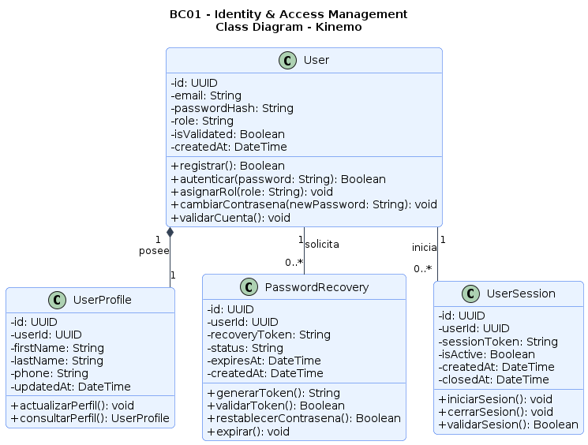
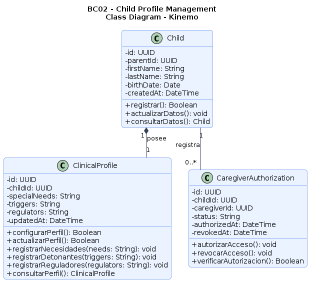
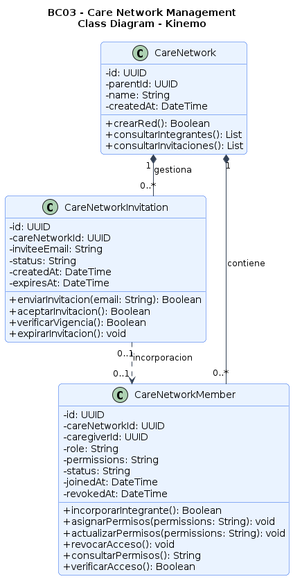
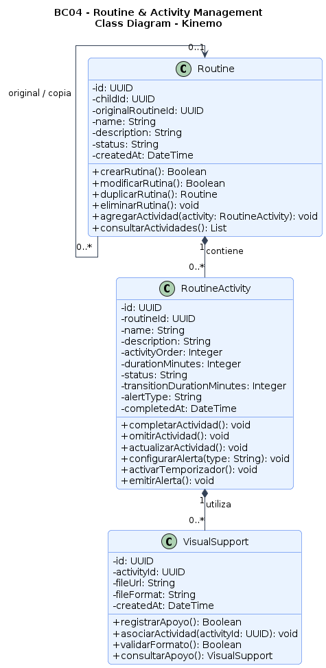
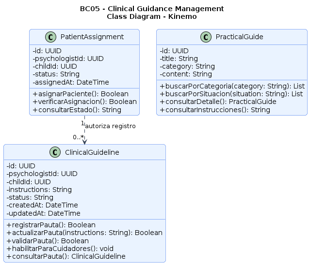
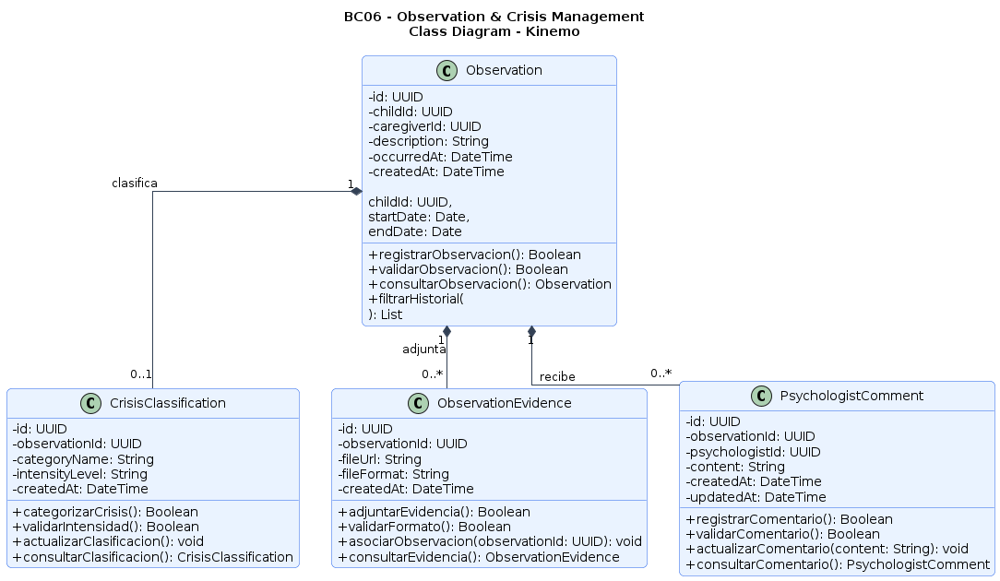
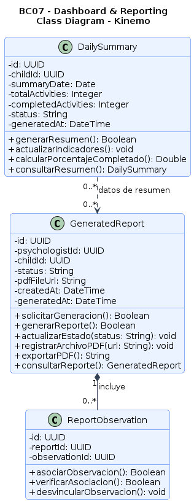
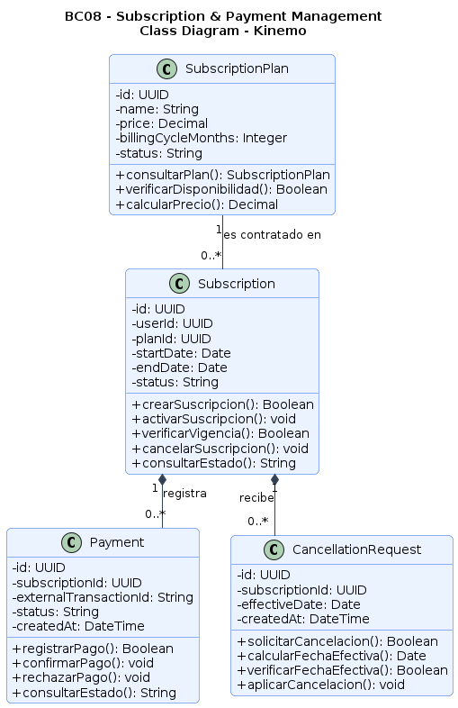

# Informe de AV1 — Kinemo

## Carátula

| Campo | Valor                                           |
|---|-------------------------------------------------|
| Universidad | Universidad Peruana de Ciencias Aplicadas (UPC) |
| Carrera | Ingeniería de Software                          |
| Ciclo | 2026-20                                         |
| Código y Nombre del Curso | 1ASI0729 - Desarrollo de Aplicaciones Open Source                     |
| NRC | 7793                                            |
| Profesor | Ivan Robles Fernández                   |
| Nombre del Startup | NeuroSync                               |
| Nombre del Producto | Kinemo                                          |
| año | 2026                                            |

**Integrantes**

| Código     | Apellidos y Nombres        |
|------------|----------------------------|
|  u20241b932 | Huamanchumo Chicchon, Felipe Marcelo |
|  u202416903 | Vilchez Vite, Gabriel Alejandro     |
| u202212327 | Flores Chavez, Fabricio     |
| u202419311 | Matthew Shinko Okuhama Diaz     |
| u202318865 | Trigoso Garrido, Cristian Joseph     |

## Registro de Versiones del Informe

| Versión | Fecha | Autor | Descripción de modificación |
|---|---|---|---|
| 1.0 | |  |  |

## Project Report Collaboration Insights

Repositorio del Project Report: 

> _Pendiente — a partir de AV1, agregar explicación del proceso de elaboración del informe y capturas de los analíticos de colaboración/commits de GitHub._

## Contenido

- [Student Outcome](#student-outcome)
- [Capítulo I: Introducción](#capítulo-i-introducción)
    - [1.1 Startup Profile](#11-startup-profile)
        - [1.1.1 Descripción de la Startup](#111-descripción-de-la-startup)
        - [1.1.2 Perfiles de integrantes del equipo](#112-perfiles-de-integrantes-del-equipo)
    - [1.2 Solution Profile](#12-solution-profile)
        - [1.2.1 Antecedentes y problemática](#121-antecedentes-y-problemática)
        - [1.2.2 Lean UX Process](#122-lean-ux-process)
            - [1.2.2.1 Lean UX Problem Statements](#1221-lean-ux-problem-statements)
            - [1.2.2.2 Lean UX Assumptions](#1222-lean-ux-assumptions)
            - [1.2.2.3 Lean UX Hypothesis Statements](#1223-lean-ux-hypothesis-statements)
            - [1.2.2.4 Lean UX Canvas](#1224-lean-ux-canvas)
    - [1.3 Segmentos objetivo](#13-segmentos-objetivo)
- [Capítulo II: Requirements Elicitation & Analysis](#capítulo-ii-requirements-elicitation--analysis)
    - [2.1 Competidores](#21-competidores)
        - [2.1.1 Análisis competitivo](#211-análisis-competitivo)
        - [2.1.2 Estrategias y tácticas frente a competidores](#212-estrategias-y-tácticas-frente-a-competidores)
    - [2.2 Entrevistas](#22-entrevistas)
        - [2.2.1 Diseño de entrevistas](#221-diseño-de-entrevistas)
        - [2.2.2 Registro de entrevistas](#222-registro-de-entrevistas)
        - [2.2.3 Análisis de entrevistas](#223-análisis-de-entrevistas)
    - [2.3 Needfinding](#23-needfinding)
        - [2.3.1 User Personas](#231-user-personas)
        - [2.3.2 User Task Matrix](#232-user-task-matrix)
        - [2.3.3 User Journey Mapping](#233-user-journey-mapping)
        - [2.3.4 Empathy Mapping](#234-empathy-mapping)
    - [2.4 Big Picture EventStorming](#24-big-picture-eventstorming)
    - [2.5 Ubiquitous Language](#25-ubiquitous-language)
- [Capítulo III: Requirements Specification](#capítulo-iii-requirements-specification)
    - [3.1 User Stories](#31-user-stories)
    - [3.2 Impact Mapping](#32-impact-mapping)
    - [3.3 Product Backlog](#33-product-backlog)
- [Capítulo IV: Product Design](#capítulo-iv-product-design)
    - [4.1 Style Guidelines](#41-style-guidelines)
        - [4.1.1 General Style Guidelines](#411-general-style-guidelines)
        - [4.1.2 Web Style Guidelines](#412-web-style-guidelines)
    - [4.2 Information Architecture](#42-information-architecture)
        - [4.2.1 Organization Systems](#421-organization-systems)
        - [4.2.2 Labeling Systems](#422-labeling-systems)
        - [4.2.3 SEO Tags and Meta Tags](#423-seo-tags-and-meta-tags)
        - [4.2.4 Searching Systems](#424-searching-systems)
        - [4.2.5 Navigation Systems](#425-navigation-systems)
    - [4.3 Landing Page UI Design](#43-landing-page-ui-design)
        - [4.3.1 Landing Page Wireframe](#431-landing-page-wireframe)
        - [4.3.2 Landing Page Mock-up](#432-landing-page-mock-up)
    - [4.4 Web Applications UX/UI Design](#44-web-applications-uxui-design)
        - [4.4.1 Web Applications Wireframes](#441-web-applications-wireframes)
        - [4.4.2 Web Applications Wireflow Diagrams](#442-web-applications-wireflow-diagrams)
        - [4.4.3 Web Applications Mock-ups](#443-web-applications-mock-ups)
        - [4.4.4 Web Applications User Flow Diagrams](#444-web-applications-user-flow-diagrams)
    - [4.5 Web Applications Prototyping](#45-web-applications-prototyping)
    - [4.6 Domain-Driven Software Architecture](#46-domain-driven-software-architecture)
        - [4.6.1 Design-Level EventStorming](#461-design-level-eventstorming)
        - [4.6.2 Software Architecture Context Diagram](#462-software-architecture-context-diagram)
        - [4.6.3 Software Architecture Container Diagrams](#463-software-architecture-container-diagrams)
        - [4.6.4 Software Architecture Component Diagrams](#464-software-architecture-component-diagrams)
    - [4.7 Software Object-Oriented Design](#47-software-object-oriented-design)
        - [4.7.1 Class Diagrams](#471-class-diagrams)
    - [4.8 Database Design](#48-database-design)
        - [4.8.1 Database Diagrams](#481-database-diagrams)
- [Capítulo V: Product Implementation, Validation & Deployment](#capítulo-v-product-implementation-validation--deployment)
    - [5.1 Software Configuration Management](#51-software-configuration-management)
        - [5.1.1 Software Development Environment Configuration](#511-software-development-environment-configuration)
        - [5.1.2 Source Code Management](#512-source-code-management)
        - [5.1.3 Source Code Style Guide & Coding Conventions](#513-source-code-style-guide--coding-conventions)
        - [5.1.4 Software Deployment Configuration](#514-software-deployment-configuration)
    - [5.2 Landing Page, Services & Applications Implementation](#52-landing-page-services--applications-implementation)
        - [5.2.1 Sprint 1 (AV1)](#521-sprint-1-av1)
        - [5.2.2 Sprint 2 (TB1)](#522-sprint-2-tb1)
        - [5.2.3 Sprint 3 (AV2)](#523-sprint-3-av2)
        - [5.2.4 Sprint 4 (TB2)](#524-sprint-4-tb2)
    - [5.3 Validation Interviews](#53-validation-interviews)
        - [5.3.1 Diseño de Entrevistas](#531-diseño-de-entrevistas)
        - [5.3.2 Registro de Entrevistas](#532-registro-de-entrevistas)
        - [5.3.3 Evaluaciones según heurísticas](#533-evaluaciones-según-heurísticas)
    - [5.4 Video About-the-Product](#54-video-about-the-product)
- [Conclusiones](#conclusiones)
    - [Conclusiones y recomendaciones](#conclusiones-y-recomendaciones)
    - [Video About-the-Team](#video-about-the-team)
- [Bibliografía](#bibliografía)
- [Anexos](#anexos)
    - [Anexo A. Videos de Exposiciones](#anexo-a-videos-de-exposiciones)

> Nota: estos enlaces se generaron manualmente siguiendo la convención de anchors de GitHub. Verifícalos una vez renderizado el archivo (clic en el ícono de enlace de cada título) y corrígelos si alguno no coincide, tal como pide el enunciado antes de cada entrega.

## Student Outcome

El curso contribuye al cumplimiento del Student Outcome ABET:

**ABET – EAC - Student Outcome 5**

Criterio: Capacidad de comunicarse efectivamente con un rango de audiencias.

En el siguiente cuadro se describe las acciones realizadas y enunciados de conclusiones por parte del grupo, que permiten sustentar el haber alcanzado el logro del ABET – EAC - Student Outcome 5.

| Criterio específico | Acciones realizadas | Conclusiones |
|--|---|---|
|  |  |  |

## Capítulo I: Introducción

### 1.1 Startup Profile

#### 1.1.1 Descripción de la Startup

> _Pendiente — completar en `feature/startup-profile`._

#### 1.1.2 Perfiles de integrantes del equipo

> _Pendiente — completar en `feature/startup-profile` (foto, nombres, código, carrera, conocimientos técnicos por integrante)._

### 1.2 Solution Profile

#### 1.2.1 Antecedentes y problemática

#### 1.2.2 Lean UX Process

##### 1.2.2.1 Lean UX Problem Statements

> _Pendiente — completar en `feature/lean-ux-process`._

##### 1.2.2.2 Lean UX Assumptions

> _Pendiente — completar en `feature/lean-ux-process`._

##### 1.2.2.3 Lean UX Hypothesis Statements

> _Pendiente — completar en `feature/lean-ux-process`._

##### 1.2.2.4 Lean UX Canvas

> _Pendiente — completar en `feature/lean-ux-process`._

### 1.3 Segmentos objetivo

> _Pendiente — completar en `feature/target-segments`._

## Capítulo II: Requirements Elicitation & Analysis

### 2.1 Competidores

#### 2.1.1 Análisis competitivo

> _Pendiente — completar en `feature/competitive-analysis`._

#### 2.1.2 Estrategias y tácticas frente a competidores

> _Pendiente — completar en `feature/competitive-analysis`._

### 2.2 Entrevistas

#### 2.2.1 Diseño de entrevistas

> _Pendiente — completar en `feature/interview-design`._

#### 2.2.2 Registro de entrevistas

> _Bloqueado — depende de realizar las entrevistas reales a ambos segmentos objetivo._

#### 2.2.3 Análisis de entrevistas

> _Bloqueado — depende de 2.2.2._

### 2.3 Needfinding

#### 2.3.1 User Personas

> _Pendiente — completar en `feature/user-personas`._

#### 2.3.2 User Task Matrix

> _Pendiente — completar en `feature/user-task-matrix`._

#### 2.3.3 User Journey Mapping

> _Pendiente — completar en `feature/journey-maps`._

#### 2.3.4 Empathy Mapping

> _Pendiente — completar en `feature/empathy-maps`._

### 2.4 Big Picture EventStorming

> _Pendiente — completar en `feature/event-storming-big-picture`._

### 2.5 Ubiquitous Language

> _Pendiente — completar en `feature/ubiquitous-language`._

## Capítulo III: Requirements Specification

### 3.1 User Stories

> _Pendiente — completar en `feature/user-stories`._

### 3.2 Impact Mapping

> _Pendiente — completar en `feature/impact-mapping`._

### 3.3 Product Backlog

> _Pendiente — completar en `feature/product-backlog`._

## Capítulo IV: Product Design

### 4.1 Style Guidelines

#### 4.1.1 General Style Guidelines

> _Pendiente — completar en `feature/style-guidelines`._

#### 4.1.2 Web Style Guidelines

> _Pendiente — completar en `feature/style-guidelines`._

### 4.2 Information Architecture

#### 4.2.1 Organization Systems

> _Pendiente — completar en `feature/information-architecture`._

#### 4.2.2 Labeling Systems

> _Pendiente — completar en `feature/information-architecture`._

#### 4.2.3 SEO Tags and Meta Tags

> _Pendiente — completar en `feature/information-architecture`._

#### 4.2.4 Searching Systems

> _Pendiente — completar en `feature/information-architecture`._

#### 4.2.5 Navigation Systems

> _Pendiente — completar en `feature/information-architecture`._

### 4.3 Landing Page UI Design

#### 4.3.1 Landing Page Wireframe

> _Pendiente — completar en `feature/landing-page-ui`._

#### 4.3.2 Landing Page Mock-up

> _Pendiente — completar en `feature/landing-page-ui`._

### 4.4 Web Applications UX/UI Design

#### 4.4.1 Web Applications Wireframes

> _Pendiente — completar en `feature/web-app-ux`._

#### 4.4.2 Web Applications Wireflow Diagrams

> _Pendiente — completar en `feature/web-app-ux`._

#### 4.4.3 Web Applications Mock-ups

> _Pendiente — completar en `feature/web-app-ux`._

#### 4.4.4 Web Applications User Flow Diagrams

> _Pendiente — completar en `feature/web-app-ux`._

### 4.5 Web Applications Prototyping

> _Pendiente — completar en `feature/web-app-prototyping`._

### 4.6 Domain-Driven Software Architecture

#### 4.6.1 Design-Level EventStorming

> _Pendiente — completar en `feature/domain-driven-architecture`._

#### 4.6.2 Software Architecture Context Diagram

> _Pendiente — completar en `feature/domain-driven-architecture`._

#### 4.6.3 Software Architecture Container Diagrams

> _Pendiente — completar en `feature/domain-driven-architecture`._

#### 4.6.4 Software Architecture Component Diagrams

> _Pendiente — completar en `feature/domain-driven-architecture`._

### 4.7 Software Object-Oriented Design

#### 4.7.1 Class Diagrams

Los diagramas de clases de Kinemo representan la estructura orientada a objetos de los ocho Bounded Contexts identificados en el proyecto. Cada diagrama presenta las clases, atributos, métodos y relaciones correspondientes a su contexto, manteniendo la separación de responsabilidades establecida en el diseño del sistema.

A continuación, se presentan los diagramas de clases organizados desde BC01 hasta BC08.

##### Identity & Access Management

El diagrama de clases del Bounded Context Identity & Access Management representa la estructura orientada a objetos encargada de gestionar la identidad y el acceso de los usuarios de Kinemo. La clase User constituye la entidad principal, ya que administra las credenciales, el rol y el estado de validación de cada cuenta.

La clase UserProfile almacena la información personal del usuario y mantiene una relación de composición de uno a uno con User. Por otro lado, PasswordRecovery permite gestionar las solicitudes de recuperación de contraseñas mediante tokens temporales, mientras que UserSession registra el inicio, la validación y el cierre de las sesiones. Ambas clases mantienen relaciones de uno a muchos con User, debido a que una cuenta puede generar múltiples solicitudes de recuperación y sesiones durante su ciclo de vida.

Los métodos definidos responden a los procesos identificados en el Design-Level EventStorming, incluyendo el registro de cuentas, la autenticación, la actualización del perfil, la recuperación de contraseñas y el cierre de sesión. De esta manera, el diagrama establece una estructura coherente con los requerimientos funcionales y el diseño de base de datos de Kinemo.

##### Child Profile Management

El diagrama de clases del Bounded Context Child Profile Management representa la estructura orientada a objetos encargada de administrar la información personal y el perfil de apoyo de los niños registrados en Kinemo. La clase Child constituye la entidad principal, ya que almacena los datos básicos del menor y mantiene una referencia al padre o tutor responsable mediante el atributo parentId.

La clase ClinicalProfile mantiene una relación de composición de uno a uno con Child y permite registrar las necesidades particulares, detonantes y reguladores del niño. Asimismo, incorpora operaciones para configurar, actualizar y consultar dicha información. Por otro lado, CaregiverAuthorization gestiona los permisos de consulta mediante una relación de uno a muchos con Child, permitiendo registrar y revocar autorizaciones de acceso para distintos cuidadores.

Los métodos definidos responden a los procesos de configuración, actualización y consulta identificados en el Design-Level EventStorming. De esta manera, el diagrama establece una estructura coherente con los requerimientos funcionales y el diseño de base de datos de Kinemo, manteniendo la información del niño separada de la gestión de identidades y de la administración de la red de cuidado.

##### Care Network Management

Para mantener la separación entre los Bounded Contexts, no incluimos la clase User del BC01 ni duplicamos CaregiverAuthorization del BC02. Utilizamos parentId y caregiverId como referencias a usuarios de otros contextos.

Además, el modelo mantiene el historial de integrantes revocados mediante los atributos status y revokedAt, en lugar de eliminar necesariamente sus registros. Esto coincide con el diseño descrito para Care_network_members.

##### Routine Management

No incluimos la clase Child, porque pertenece al BC02 — Child Profile Management. El atributo childId permite mantener la referencia al niño sin duplicar su información.

No agregamos una clase independiente para el temporizador o las alertas, porque el diseño de base de datos existente contempla los campos transition_duration_minutes y alert_type dentro de Routine_activities.

La duplicación no debe modificar la rutina original. El método duplicarRutina() devuelve una nueva rutina y la relación recursiva permite conservar la trazabilidad de su origen. Esto responde a las reglas establecidas en el EventStorming.

La ejecución automática del temporizador y la emisión de alertas podrían requerir un servicio de aplicación durante la implementación. En este diagrama se representan como operaciones de RoutineActivity para mantener el modelo solicitado con las tres entidades existentes.

##### Clinical Guidance Management

No incluimos las clases User ni Child, porque pertenecen al BC01 y BC02, respectivamente. Utilizamos sus identificadores para mantener la separación entre contextos.

PatientAssignment representa una relación profesional activa. Su método verificarAsignacion() permite comprobar la autorización antes de registrar o actualizar pautas.

Las guías prácticas no dependen de que exista una pauta clínica individualizada. El EventStorming las presenta como un repositorio independiente y establece que su búsqueda y consulta son Queries.

El método habilitarParaCuidadores() representa la disponibilidad de la pauta, pero no reemplaza las verificaciones de permisos correspondientes al cuidador. La implementación deberá comprobar esos permisos antes de entregar información clínica.

No agregamos una clase ClinicalGuidelineVersion, porque el diseño actual contempla la actualización de las instrucciones mediante updated_at, pero no define una entidad independiente para almacenar un historial de versiones.

##### Observation Management

Para mantener la separación de Bounded Contexts, no incluimos las clases User ni Child, porque pertenecen a BC01 y BC02. Los atributos caregiverId, psychologistId y childId permiten referenciar estas entidades sin duplicarlas.

El EventStorming establece los niveles de intensidad Leve, Moderado y Severo. Por ello, validarIntensidad() debe comprobar que el valor ingresado pertenezca a ese conjunto.

Antes de registrar un comentario, debe verificarse que el psicólogo esté autorizado para revisar la observación. Esta regla aparece expresamente en el EventStorming.

El registro de un comentario genera una notificación para los padres. No agregamos una clase Notification porque no aparece entre las entidades de base de datos de BC06. Su implementación deberá definirse en el componente correspondiente.

El psicólogo debe poder filtrar observaciones por tipo de evento y rango temporal. En el código se representa el rango de fechas; para implementar todos los filtros, también deberá contemplarse el tipo de evento en la consulta.

##### Reporting & Monitoring

Para mantener la separación de contextos, no incluimos las clases Child, RoutineActivity ni Observation. BC07 utiliza información producida por BC02, BC04 y BC06, pero no debe duplicar sus responsabilidades.

DailySummary consolida indicadores para su consulta. El registro y la modificación de actividades continúan siendo responsabilidad del BC04.

GeneratedReport conserva la URL del archivo generado mediante pdfFileUrl. El método exportarPDF() debe comprobar que el archivo esté disponible antes de permitir su descarga.

ReportObservation permite identificar qué observaciones se incluyeron en cada reporte. Esto resulta útil para relacionar los reportes con los registros originales del BC06.

Antes de generar o consultar un reporte, la implementación debe verificar que el psicólogo tenga acceso al niño correspondiente. Esta comprobación puede utilizar la asignación profesional definida en BC05.

##### Subscription & Payment Management

El modelo contempla exclusivamente planes de pago familiares y profesionales. No agregamos funcionalidades de prueba gratuita ni planes freemium.

La activación está condicionada al pago. El método activarSuscripcion() solo debe ejecutarse después de recibir y validar la confirmación del proveedor externo. Una transacción rechazada no debe activar la suscripción.

El método solicitarCancelacion() registra la intención del usuario, mientras que aplicarCancelacion() cambia el estado cuando llega la fecha efectiva. Son operaciones distintas.

Para mantener la separación de contextos, no incluimos la clase User porque pertenece al BC01. El atributo userId permite asociar la suscripción a la cuenta correspondiente.

El atributo externalTransactionId permite identificar la operación procesada fuera de Kinemo. La validación de las confirmaciones del proveedor debe resolverse en la implementación de la integración de pagos.

Una suscripción puede tener varias transacciones, por lo que el modelo conserva los pagos confirmados y rechazados en lugar de sobrescribirlos.

### 4.8 Database Design

#### 4.8.1 Database Diagrams

> _Pendiente — completar en `feature/database-design`._

## Capítulo V: Product Implementation, Validation & Deployment

### 5.1 Software Configuration Management

#### 5.1.1 Software Development Environment Configuration

> _Pendiente — completar en `feature/software-configuration-management` (urgente para AV1)._

#### 5.1.2 Source Code Management

> _Pendiente — agregar URLs de los 4 repositorios, explicación de GitFlow, convenciones de branches y Conventional Commits. Completar en `feature/software-configuration-management` (urgente para AV1)._

#### 5.1.3 Source Code Style Guide & Coding Conventions

> _Pendiente — completar en `feature/software-configuration-management`._

#### 5.1.4 Software Deployment Configuration

> _Pendiente — completar en `feature/software-configuration-management`._

### 5.2 Landing Page, Services & Applications Implementation

#### 5.2.1 Sprint 1 (AV1)

##### 5.2.1.1 Sprint Planning 1
> _Pendiente._
##### 5.2.1.2 Aspect Leaders and Collaborators
> _Pendiente._
##### 5.2.1.3 Sprint Backlog 1
> _Pendiente._
##### 5.2.1.4 Development Evidence for Sprint Review
> _Pendiente._
##### 5.2.1.5 Execution Evidence for Sprint Review
> _Pendiente._
##### 5.2.1.6 Services Documentation Evidence for Sprint Review
> _Pendiente._
##### 5.2.1.7 Software Deployment Evidence for Sprint Review
> _Pendiente._
##### 5.2.1.8 Team Collaboration Insights during Sprint
> _Pendiente._

#### 5.2.2 Sprint 2 (TB1)

> _A completar a partir de la entrega TB1. Misma estructura que Sprint 1 (Planning, Aspect Leaders, Backlog, Development/Execution/Services/Deployment Evidence, Team Collaboration Insights)._

#### 5.2.3 Sprint 3 (AV2)

> _A completar a partir de la entrega AV2. Misma estructura que Sprint 1._

#### 5.2.4 Sprint 4 (TB2)

> _A completar a partir de la entrega TB2. Misma estructura que Sprint 1._

### 5.3 Validation Interviews

#### 5.3.1 Diseño de Entrevistas

> _Bloqueado — depende de tener un producto/prototipo validable (a partir de AV2)._

#### 5.3.2 Registro de Entrevistas

> _Bloqueado — depende de 5.3.1._

#### 5.3.3 Evaluaciones según heurísticas

> _Bloqueado — depende de 5.3.2. Usar el formato del Anexo D del enunciado._

### 5.4 Video About-the-Product

> _A completar a partir de AV2 (primera versión), versión final en TB2._

## Conclusiones

### Conclusiones y recomendaciones

> _Pendiente — sección acumulable, versión final en TB2._

### Video About-the-Team

> _A completar a partir de AV2 (primera versión), versión final en TB2._

## Bibliografía

> _Pendiente — agregar referencias en formato APA conforme se citen fuentes en cada sección._

## Anexos

### Anexo A. Videos de Exposiciones

| Entrega | Título del video | Enlace |
|---|---|---|
| AV1 | `[Pendiente]` | `[Pendiente]` |