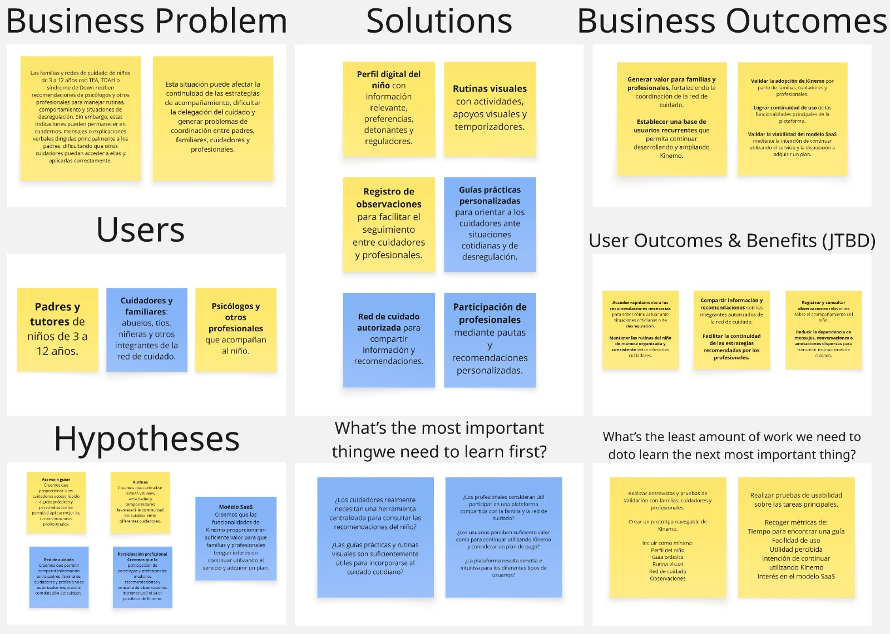

# Informe de AV1 — Kinemo

## Carátula

| Campo | Valor                                           |
|---|-------------------------------------------------|
| Universidad | Universidad Peruana de Ciencias Aplicadas (UPC) |
| Carrera | Ingeniería de Software                          |
| Ciclo | 2026-20                                         |
| Código y Nombre del Curso | 1ASI0729 - Desarrollo de Aplicaciones Open Source                     |
| NRC | 7793                                            |
| Profesor | Ivan Robles Fernández                   |
| Nombre del Startup | NeuroSync                               |
| Nombre del Producto | Kinemo                                          |
| año | 2026                                            |

**Integrantes**

| Código     | Apellidos y Nombres        |
|------------|----------------------------|
|  u20241b932 | Huamanchumo Chicchon, Felipe Marcelo |
|  u202416903 | Vilchez Vite, Gabriel Alejandro     |
| u202212327 | Flores Chavez, Fabricio     |
| u202419311 | Matthew Shinko Okuhama Diaz     |
| u202318865 | Trigoso Garrido, Cristian Joseph     |

## Registro de Versiones del Informe

| Versión | Fecha | Autor | Descripción de modificación |
|---|---|---|---|
| 1.0 | |  |  |

## Project Report Collaboration Insights

Repositorio del Project Report: 

> _Pendiente — a partir de AV1, agregar explicación del proceso de elaboración del informe y capturas de los analíticos de colaboración/commits de GitHub._

## Contenido

- [Student Outcome](#student-outcome)
- [Capítulo I: Introducción](#capítulo-i-introducción)
    - [1.1 Startup Profile](#11-startup-profile)
        - [1.1.1 Descripción de la Startup](#111-descripción-de-la-startup)
        - [1.1.2 Perfiles de integrantes del equipo](#112-perfiles-de-integrantes-del-equipo)
    - [1.2 Solution Profile](#12-solution-profile)
        - [1.2.1 Antecedentes y problemática](#121-antecedentes-y-problemática)
        - [1.2.2 Lean UX Process](#122-lean-ux-process)
            - [1.2.2.1 Lean UX Problem Statements](#1221-lean-ux-problem-statements)
            - [1.2.2.2 Lean UX Assumptions](#1222-lean-ux-assumptions)
            - [1.2.2.3 Lean UX Hypothesis Statements](#1223-lean-ux-hypothesis-statements)
            - [1.2.2.4 Lean UX Canvas](#1224-lean-ux-canvas)
    - [1.3 Segmentos objetivo](#13-segmentos-objetivo)
- [Capítulo II: Requirements Elicitation & Analysis](#capítulo-ii-requirements-elicitation--analysis)
    - [2.1 Competidores](#21-competidores)
        - [2.1.1 Análisis competitivo](#211-análisis-competitivo)
        - [2.1.2 Estrategias y tácticas frente a competidores](#212-estrategias-y-tácticas-frente-a-competidores)
    - [2.2 Entrevistas](#22-entrevistas)
        - [2.2.1 Diseño de entrevistas](#221-diseño-de-entrevistas)
        - [2.2.2 Registro de entrevistas](#222-registro-de-entrevistas)
        - [2.2.3 Análisis de entrevistas](#223-análisis-de-entrevistas)
    - [2.3 Needfinding](#23-needfinding)
        - [2.3.1 User Personas](#231-user-personas)
        - [2.3.2 User Task Matrix](#232-user-task-matrix)
        - [2.3.3 User Journey Mapping](#233-user-journey-mapping)
        - [2.3.4 Empathy Mapping](#234-empathy-mapping)
    - [2.4 Big Picture EventStorming](#24-big-picture-eventstorming)
    - [2.5 Ubiquitous Language](#25-ubiquitous-language)
- [Capítulo III: Requirements Specification](#capítulo-iii-requirements-specification)
    - [3.1 User Stories](#31-user-stories)
    - [3.2 Impact Mapping](#32-impact-mapping)
    - [3.3 Product Backlog](#33-product-backlog)
- [Capítulo IV: Product Design](#capítulo-iv-product-design)
    - [4.1 Style Guidelines](#41-style-guidelines)
        - [4.1.1 General Style Guidelines](#411-general-style-guidelines)
        - [4.1.2 Web Style Guidelines](#412-web-style-guidelines)
    - [4.2 Information Architecture](#42-information-architecture)
        - [4.2.1 Organization Systems](#421-organization-systems)
        - [4.2.2 Labeling Systems](#422-labeling-systems)
        - [4.2.3 SEO Tags and Meta Tags](#423-seo-tags-and-meta-tags)
        - [4.2.4 Searching Systems](#424-searching-systems)
        - [4.2.5 Navigation Systems](#425-navigation-systems)
    - [4.3 Landing Page UI Design](#43-landing-page-ui-design)
        - [4.3.1 Landing Page Wireframe](#431-landing-page-wireframe)
        - [4.3.2 Landing Page Mock-up](#432-landing-page-mock-up)
    - [4.4 Web Applications UX/UI Design](#44-web-applications-uxui-design)
        - [4.4.1 Web Applications Wireframes](#441-web-applications-wireframes)
        - [4.4.2 Web Applications Wireflow Diagrams](#442-web-applications-wireflow-diagrams)
        - [4.4.3 Web Applications Mock-ups](#443-web-applications-mock-ups)
        - [4.4.4 Web Applications User Flow Diagrams](#444-web-applications-user-flow-diagrams)
    - [4.5 Web Applications Prototyping](#45-web-applications-prototyping)
    - [4.6 Domain-Driven Software Architecture](#46-domain-driven-software-architecture)
        - [4.6.1 Design-Level EventStorming](#461-design-level-eventstorming)
        - [4.6.2 Software Architecture Context Diagram](#462-software-architecture-context-diagram)
        - [4.6.3 Software Architecture Container Diagrams](#463-software-architecture-container-diagrams)
        - [4.6.4 Software Architecture Component Diagrams](#464-software-architecture-component-diagrams)
    - [4.7 Software Object-Oriented Design](#47-software-object-oriented-design)
        - [4.7.1 Class Diagrams](#471-class-diagrams)
    - [4.8 Database Design](#48-database-design)
        - [4.8.1 Database Diagrams](#481-database-diagrams)
- [Capítulo V: Product Implementation, Validation & Deployment](#capítulo-v-product-implementation-validation--deployment)
    - [5.1 Software Configuration Management](#51-software-configuration-management)
        - [5.1.1 Software Development Environment Configuration](#511-software-development-environment-configuration)
        - [5.1.2 Source Code Management](#512-source-code-management)
        - [5.1.3 Source Code Style Guide & Coding Conventions](#513-source-code-style-guide--coding-conventions)
        - [5.1.4 Software Deployment Configuration](#514-software-deployment-configuration)
    - [5.2 Landing Page, Services & Applications Implementation](#52-landing-page-services--applications-implementation)
        - [5.2.1 Sprint 1 (AV1)](#521-sprint-1-av1)
        - [5.2.2 Sprint 2 (TB1)](#522-sprint-2-tb1)
        - [5.2.3 Sprint 3 (AV2)](#523-sprint-3-av2)
        - [5.2.4 Sprint 4 (TB2)](#524-sprint-4-tb2)
    - [5.3 Validation Interviews](#53-validation-interviews)
        - [5.3.1 Diseño de Entrevistas](#531-diseño-de-entrevistas)
        - [5.3.2 Registro de Entrevistas](#532-registro-de-entrevistas)
        - [5.3.3 Evaluaciones según heurísticas](#533-evaluaciones-según-heurísticas)
    - [5.4 Video About-the-Product](#54-video-about-the-product)
- [Conclusiones](#conclusiones)
    - [Conclusiones y recomendaciones](#conclusiones-y-recomendaciones)
    - [Video About-the-Team](#video-about-the-team)
- [Bibliografía](#bibliografía)
- [Anexos](#anexos)
    - [Anexo A. Videos de Exposiciones](#anexo-a-videos-de-exposiciones)

> Nota: estos enlaces se generaron manualmente siguiendo la convención de anchors de GitHub. Verifícalos una vez renderizado el archivo (clic en el ícono de enlace de cada título) y corrígelos si alguno no coincide, tal como pide el enunciado antes de cada entrega.

## Student Outcome

El curso contribuye al cumplimiento del Student Outcome ABET:

**ABET – EAC - Student Outcome 5**

Criterio: Capacidad de comunicarse efectivamente con un rango de audiencias.

En el siguiente cuadro se describe las acciones realizadas y enunciados de conclusiones por parte del grupo, que permiten sustentar el haber alcanzado el logro del ABET – EAC - Student Outcome 5.

| Criterio específico | Acciones realizadas | Conclusiones |
|--|---|---|
|  |  |  |

## Capítulo I: Introducción

### 1.1 Startup Profile

#### 1.1.1 Descripción de la Startup

> _Pendiente — completar en `feature/startup-profile`._

#### 1.1.2 Perfiles de integrantes del equipo

> _Pendiente — completar en `feature/startup-profile` (foto, nombres, código, carrera, conocimientos técnicos por integrante)._

### 1.2 Solution Profile

#### 1.2.1 Antecedentes y problemática

#### 1.2.2 Lean UX Process

En el presente apartado se implementa el procedimiento Lean UX para determinar la propuesta de valor de NeuroSync y Kinemo, en tanto que Brand new initiative. A partir de las necesidades del usuario y de la brecha definida, se desarrollan los Problem Statements, Assumptions e Hypothesis Statements. Y estos se incorporan, finalmente, en el Lean UX Canvas para definir la propuesta en su conjunto.

##### 1.2.2.1 Lean UX Problem Statements

En el contexto del cuidado de niños de 3 a 12 años con condiciones del neurodesarrollo como TEA, TDAH y síndrome de Down, las familias suelen contar con recomendaciones proporcionadas por psicólogos y otros profesionales para manejar rutinas, comportamiento y situaciones de desregulación. Sin embargo, estas indicaciones pueden mantenerse principalmente en cuadernos, mensajes o explicaciones verbales dirigidas a los padres, dificultando que otros miembros de la red de cuidado puedan acceder a ellas y aplicarlas correctamente.

Esto genera que abuelos, tíos, niñeras y otros cuidadores puedan no conocer las estrategias adecuadas para responder ante una situación de desregulación, un cambio de rutina o una transición. Como consecuencia, los padres pueden tener dificultades para delegar el cuidado con tranquilidad y puede verse afectada la continuidad de las estrategias trabajadas durante el acompañamiento profesional.

Actualmente, las familias y profesionales cuentan con diferentes herramientas digitales para organizar actividades, rutinas o información, pero existe una oportunidad de integrar en un mismo espacio el perfil del niño, sus rutinas, guías prácticas, observaciones y la participación de los miembros autorizados de su red de cuidado.

Por ello, se busca mejorar la continuidad y coordinación del cuidado mediante una herramienta digital accesible que permita organizar rutinas, consultar guías prácticas y compartir recomendaciones personalizadas entre las familias, cuidadores y profesionales involucrados.

Para comenzar, el enfoque estará en las familias y personas cercanas que participan directamente en el cuidado de niños de 3 a 12 años con TEA, TDAH o síndrome de Down, considerando también la participación de psicólogos y otros profesionales relacionados con su acompañamiento.

##### 1.2.2.2 Lean UX Assumptions

* **¿Quién o quiénes son los usuarios?** Pensamos que los principales son las familias y personas de referencia que forman parte de la red de cuidado de niños y niñas de 3 a 12 años de edad con TEA, TDAH o síndrome de Down. Este colectivo puede estar formado por padres, abuelos, tíos y otros cuidadores que necesitan conocer las rutinas y estrategias recomendadas para la atención del niño.  También consideramos como usuarios a psicólogos u otros profesionales de los que acompañan al niño, dado que pueden proporcionar indicaciones personalizadas, así como consultar información relevante para la atención del niño.
  
* **¿Cuál es el problema real?** Pensamos que el principal obstáculo es que no siempre se pueden establecer y mantener de forma suficiente y clara las recomendaciones educativas del cuidado del niño a toda la red de cuidado y entre los cuidadores de ese niño.  Si la información aparece, pues, en las conversaciones, las anotaciones en cuadernos o derivada de las indicaciones dadas a los padres, entonces otros cuidadores pueden no estar al corriente de las instrucciones para saber cómo deben actuar ante un comportamiento de desregulación, cambios de la rutina o necesidades específicas del niño.
  
* **¿Cúal solución podría funcionar contra el problema?** Pensamos que una plataforma web, como Kinemo, puede ayudar a centralizar la información más relevante del niño/a y facilitar el acceso de los miembros acreditados de su red de cuidado.  La solución permitirá tener un perfil del niño/a, gestionar rutinas visuales, consultar guías prácticas para situaciones de desregulación, usar temporizadores, registrar observaciones, etc. Y los o las profesionales podrán ofrecer pautas concretas para poder enriquecer el acompañamiento del niño/a.
  
* **¿Cuáles son sus beneficios?** Nuestro convencimiento es que la solución es capaz de ayudar a la comunicación y a la coordinación entre padres, familiares, cuidadores y profesionales.  Asimismo, también puede ayudar a que los cuidadores tengan instrucciones prácticas y explícitas cuando deban actuar ante situaciones cotidianas y de esta forma permitir una mayor continuidad en estrategias de acompañamiento del niño.  Por último, para los profesionales puede facilitar la posibilidad de poder dar seguimiento a la información que la familia puede presentar y dar lugar a recomendaciones personalizadas.
  
* **¿Esta plataforma es viable?** Pensamos que Kinemo (la aplicación en función de la tecnología y la disponibilidad) podría llegar a ser un software SaaS dirigido a familias y profesionales. El modelo de negocio considera diferentes planes asociados al tipo de usuario, permitiendo poder ofrecer funcionalidades que vayan ligadas a cada tipo de usuario.  La viabilidad de la propuesta debe ser validada en un proceso de prueba con familias, cuidadores y profesionales, buscando, sobre todo, la valoración de la utilidad de las funcionalidades, de la facilidad de uso y de la disponibilidad de uso y pago por el servicio.
  
* **¿Qué cosas pueden salir mal con la plataforma?** Estamos convencidos de que uno de los principales riesgos es que las familias o profesionales no vean suficiente valor en la plataforma y prefieran seguir usando herramientas de las que ya tienen conocimiento para ir organizando poco a poco sus rutinas o para ir compartiendo información.  Asimismo, se establece el riesgo de que los usuarios no mantengan actualizados los perfiles, rutinas, observaciones o recomendaciones del niño, disminuyendo la utilidad de la información que hay disponible.  Por último, la aparición de nuevas soluciones digitales con funcionalidades semejantes podría hacer aumentar la competencia. Así pues, Kinemo deberá continuar validando las necesidades de sus usuarios y reforzando su propuesta de valor centrada en la coordinación de la red de cuidado y la continuidad de las recomendaciones.

##### 1.2.2.3 Lean UX Hypothesis Statements

**Hypothesis Statement 1: Acceso rápido a guías mejora la respuesta de los cuidadores**

Estamos convencidos de que permitir a los cuidadores el acceso rápido a guías prácticas y personalizadas para saber cómo actuar ante situaciones de desregulación comentadas les ayudará a aplicar las recomendaciones del profesional. Sabremos que lo hemos conseguido cuando al menos el 70% de los cuidadores participantes haya sido capaz de localizar una guía y comprenderla en un tiempo inferior a los 2 minutos y al menos el 80% indique que le resulta útil la información para actuar ante situaciones cotidianas.

**Hypothesis Statement 2: Organización de rutinas favorece la continuidad del cuidado**

Nuestra intención es que al concentrar las rutinas visuales, las actividades y los temporizadores del niño de manera central mediante Kinemo, se considere también que se da la posibilidad de que los diferentes cuidadores hagan uso de las mismas directrices a nivel diario. Sabríamos que hemos llegado a esta consecución en el momento en que al menos el 70% de los usuarios participantes efectúe un uso frecuente de las rutinas digitales cada día de forma recurrente durante las 4 primeras semanas , más del 75% indiquen que Kinemo permite llevar la coordinación de las rutinas del niño.

**Hypothesis Statement 3: Coordinación de la red de cuidado mejora la comunicación**

Entendemos que permitir a los padres, familiares, cuidadores y profesionales autorizados compartir información sobre el niño contribuirá a la coordinación de su cuidado y evitará la dependencia exclusivamente de la vía verbal del intercambio de instrucciones. Sabríamos que estaríamos en ese punto cuando al menos el 70% de las familias que participan introduzcan a uno o más cuidadores a su red de cuidados y que al menos el 75% de los usuarios consideren que compartir las recomendaciones desde Kinemo ayuda a coordinar a las personas de la red.

**Hypothesis Statement 4: Participación profesional aumenta el valor percibido de Kinemo**

A nuestro entender, el realizar el registro de recomendaciones particulares por parte de los psicólogos y/o profesionales implicados y la posible consulta de aquellas observaciones que pudieron ser realizadas por los cuidadores, sin lugar a dudas ayudará a incrementar el valor percibido de Kinemo como herramienta de acompañamiento.

Sabríamos que hemos alcanzado el objetivo si, durante la evaluación, al menos el 70% de los profesionales de la muestra registran o consultan información del niño que están evaluando y se obtiene una percepción positiva, al menos del 80%, a propósito de Kinemo como ayuda para la supervisión y el intercambio de información con la familia.

**Hypothesis Statement 5: Existe interés suficiente en el modelo SaaS de Kinemo**

Confiamos en que las familias y los profesionales percibirán un valor suficiente en las funcionalidades de Kinemo como para valorar el uso de un servicio digital especializado. Sabríamos que lo habríamos conseguido cuando al menos el 60% de los usuarios que han participado en el piloto digan que tienen intención de seguir usando la aplicación después del periodo de prueba y una proporción suficientemente alta de los usuarios que son el objetivo digan que están dispuestos a adquirir los planes que se proponen para familias y profesionales.

##### 1.2.2.4 Lean UX Canvas

**Link:** https://miro.com/welcomeonboard/enhWbkZGTENCK1YrbVprOVdhRXVWTExwZUx1QU9ESDE0VXlUbThndElveW1vM0FYTzN5UnlSR25JS3YvMHpHdnhXNnJrZEl6UHBZTUo1bWZqSHo1T2VqaGJ0MnIwcDR3MmlVUVpKNCtLYUV4YWVHTWR3MEJFVjNCc1lxZHk4YWphWWluRVAxeXRuUUgwWDl3Mk1qRGVRPT0hdjE=?share_link_id=860740998056

### 1.3 Segmentos objetivo

> _Pendiente — completar en `feature/target-segments`._

## Capítulo II: Requirements Elicitation & Analysis

### 2.1 Competidores

#### 2.1.1 Análisis competitivo

> _Pendiente — completar en `feature/competitive-analysis`._

#### 2.1.2 Estrategias y tácticas frente a competidores

> _Pendiente — completar en `feature/competitive-analysis`._

### 2.2 Entrevistas

#### 2.2.1 Diseño de entrevistas

> _Pendiente — completar en `feature/interview-design`._

#### 2.2.2 Registro de entrevistas

> _Bloqueado — depende de realizar las entrevistas reales a ambos segmentos objetivo._

#### 2.2.3 Análisis de entrevistas

> _Bloqueado — depende de 2.2.2._

### 2.3 Needfinding

#### 2.3.1 User Personas

> _Pendiente — completar en `feature/user-personas`._

#### 2.3.2 User Task Matrix

> _Pendiente — completar en `feature/user-task-matrix`._

#### 2.3.3 User Journey Mapping

> _Pendiente — completar en `feature/journey-maps`._

#### 2.3.4 Empathy Mapping

> _Pendiente — completar en `feature/empathy-maps`._

### 2.4 Big Picture EventStorming

> _Pendiente — completar en `feature/event-storming-big-picture`._

### 2.5 Ubiquitous Language

> _Pendiente — completar en `feature/ubiquitous-language`._

## Capítulo III: Requirements Specification

### 3.1 User Stories

> _Pendiente — completar en `feature/user-stories`._

### 3.2 Impact Mapping

> _Pendiente — completar en `feature/impact-mapping`._

### 3.3 Product Backlog

> _Pendiente — completar en `feature/product-backlog`._

## Capítulo IV: Product Design

### 4.1 Style Guidelines

#### 4.1.1 General Style Guidelines

> _Pendiente — completar en `feature/style-guidelines`._

#### 4.1.2 Web Style Guidelines

> _Pendiente — completar en `feature/style-guidelines`._

### 4.2 Information Architecture

#### 4.2.1 Organization Systems

> _Pendiente — completar en `feature/information-architecture`._

#### 4.2.2 Labeling Systems

> _Pendiente — completar en `feature/information-architecture`._

#### 4.2.3 SEO Tags and Meta Tags

> _Pendiente — completar en `feature/information-architecture`._

#### 4.2.4 Searching Systems

> _Pendiente — completar en `feature/information-architecture`._

#### 4.2.5 Navigation Systems

> _Pendiente — completar en `feature/information-architecture`._

### 4.3 Landing Page UI Design

#### 4.3.1 Landing Page Wireframe

> _Pendiente — completar en `feature/landing-page-ui`._

#### 4.3.2 Landing Page Mock-up

> _Pendiente — completar en `feature/landing-page-ui`._

### 4.4 Web Applications UX/UI Design

#### 4.4.1 Web Applications Wireframes

> _Pendiente — completar en `feature/web-app-ux`._

#### 4.4.2 Web Applications Wireflow Diagrams

> _Pendiente — completar en `feature/web-app-ux`._

#### 4.4.3 Web Applications Mock-ups

> _Pendiente — completar en `feature/web-app-ux`._

#### 4.4.4 Web Applications User Flow Diagrams

> _Pendiente — completar en `feature/web-app-ux`._

### 4.5 Web Applications Prototyping

> _Pendiente — completar en `feature/web-app-prototyping`._

### 4.6 Domain-Driven Software Architecture

#### 4.6.1 Design-Level EventStorming

> _Pendiente — completar en `feature/domain-driven-architecture`._

#### 4.6.2 Software Architecture Context Diagram

> _Pendiente — completar en `feature/domain-driven-architecture`._

#### 4.6.3 Software Architecture Container Diagrams

> _Pendiente — completar en `feature/domain-driven-architecture`._

#### 4.6.4 Software Architecture Component Diagrams

> _Pendiente — completar en `feature/domain-driven-architecture`._

### 4.7 Software Object-Oriented Design

#### 4.7.1 Class Diagrams

> _Pendiente — completar en `feature/class-diagrams`._

### 4.8 Database Design

#### 4.8.1 Database Diagrams

> _Pendiente — completar en `feature/database-design`._

## Capítulo V: Product Implementation, Validation & Deployment

### 5.1 Software Configuration Management

#### 5.1.1 Software Development Environment Configuration

> _Pendiente — completar en `feature/software-configuration-management` (urgente para AV1)._

#### 5.1.2 Source Code Management

> _Pendiente — agregar URLs de los 4 repositorios, explicación de GitFlow, convenciones de branches y Conventional Commits. Completar en `feature/software-configuration-management` (urgente para AV1)._

#### 5.1.3 Source Code Style Guide & Coding Conventions

> _Pendiente — completar en `feature/software-configuration-management`._

#### 5.1.4 Software Deployment Configuration

> _Pendiente — completar en `feature/software-configuration-management`._

### 5.2 Landing Page, Services & Applications Implementation

#### 5.2.1 Sprint 1 (AV1)

##### 5.2.1.1 Sprint Planning 1
> _Pendiente._
##### 5.2.1.2 Aspect Leaders and Collaborators
> _Pendiente._
##### 5.2.1.3 Sprint Backlog 1
> _Pendiente._
##### 5.2.1.4 Development Evidence for Sprint Review
> _Pendiente._
##### 5.2.1.5 Execution Evidence for Sprint Review
> _Pendiente._
##### 5.2.1.6 Services Documentation Evidence for Sprint Review
> _Pendiente._
##### 5.2.1.7 Software Deployment Evidence for Sprint Review
> _Pendiente._
##### 5.2.1.8 Team Collaboration Insights during Sprint
> _Pendiente._

#### 5.2.2 Sprint 2 (TB1)

> _A completar a partir de la entrega TB1. Misma estructura que Sprint 1 (Planning, Aspect Leaders, Backlog, Development/Execution/Services/Deployment Evidence, Team Collaboration Insights)._

#### 5.2.3 Sprint 3 (AV2)

> _A completar a partir de la entrega AV2. Misma estructura que Sprint 1._

#### 5.2.4 Sprint 4 (TB2)

> _A completar a partir de la entrega TB2. Misma estructura que Sprint 1._

### 5.3 Validation Interviews

#### 5.3.1 Diseño de Entrevistas

> _Bloqueado — depende de tener un producto/prototipo validable (a partir de AV2)._

#### 5.3.2 Registro de Entrevistas

> _Bloqueado — depende de 5.3.1._

#### 5.3.3 Evaluaciones según heurísticas

> _Bloqueado — depende de 5.3.2. Usar el formato del Anexo D del enunciado._

### 5.4 Video About-the-Product

> _A completar a partir de AV2 (primera versión), versión final en TB2._

## Conclusiones

### Conclusiones y recomendaciones

> _Pendiente — sección acumulable, versión final en TB2._

### Video About-the-Team

> _A completar a partir de AV2 (primera versión), versión final en TB2._

## Bibliografía

> _Pendiente — agregar referencias en formato APA conforme se citen fuentes en cada sección._

## Anexos

### Anexo A. Videos de Exposiciones

| Entrega | Título del video | Enlace |
|---|---|---|
| AV1 | `[Pendiente]` | `[Pendiente]` |