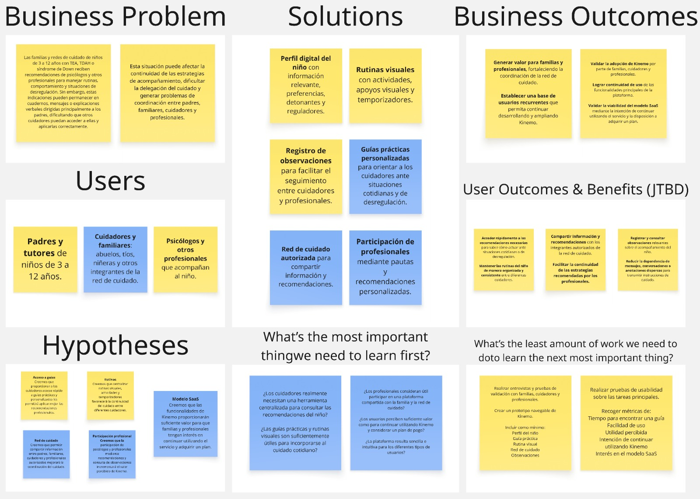
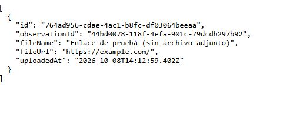
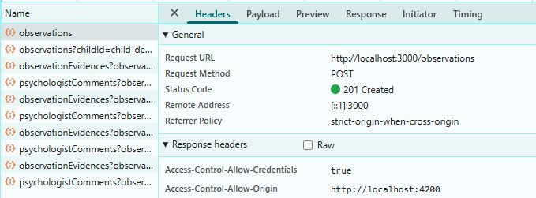
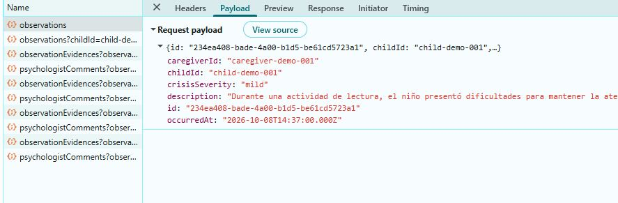
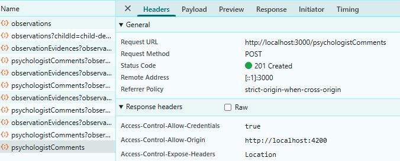
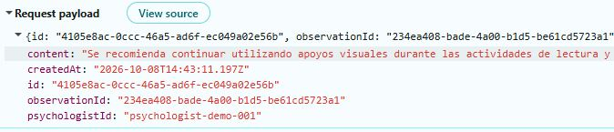
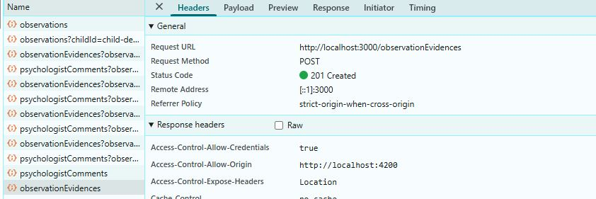

# Informe de AV1 — Kinemo

## Carátula

| Campo | Valor                                           |
|---|-------------------------------------------------|
| Universidad | Universidad Peruana de Ciencias Aplicadas (UPC) |
| Carrera | Ingeniería de Software                          |
| Ciclo | 2026-20                                         |
| Código y Nombre del Curso | 1ASI0729 - Desarrollo de Aplicaciones Open Source                     |
| NRC | 7793                                            |
| Profesor | Ivan Robles Fernández                   |
| Nombre del Startup | NeuroSync                               |
| Nombre del Producto | Kinemo                                          |
| año | 2026                                            |

**Integrantes**

| Código     | Apellidos y Nombres        |
|------------|----------------------------|
|  u20241b932 | Huamanchumo Chicchon, Felipe Marcelo |
|  u202416903 | Vilchez Vite, Gabriel Alejandro     |
| u202212327 | Flores Chavez, Fabricio     |
| u202419311 | Matthew Shinko Okuhama Diaz     |
| u202318865 | Trigoso Garrido, Cristian Joseph     |

## Registro de Versiones del Informe

| Versión | Fecha | Autor | Descripción de modificación |
|---|---|---|---|
| 1.0 | |  |  |

## Project Report Collaboration Insights

Repositorio del Project Report: 

> _Pendiente — a partir de AV1, agregar explicación del proceso de elaboración del informe y capturas de los analíticos de colaboración/commits de GitHub._

## Contenido

- [Capítulo I: Introducción](#capítulo-i-introducción)
    - [1.1. Startup Profile](#11-startup-profile)
        - [1.1.1. Descripción de la Startup](#111-descripción-de-la-startup)
        - [1.1.2. Perfiles de integrantes del equipo](#112-perfiles-de-integrantes-del-equipo)
    - [1.2. Solution Profile](#12-solution-profile)
        - [1.2.1 Antecedentes y problemática](#121-antecedentes-y-problemática)
        - [1.2.2 Lean UX Process](#122-lean-ux-process)
            - [1.2.2.1. Lean UX Problem Statements](#1221-lean-ux-problem-statements)
            - [1.2.2.2. Lean UX Assumptions](#1222-lean-ux-assumptions)
            - [1.2.2.3. Lean UX Hypothesis Statements](#1223-lean-ux-hypothesis-statements)
            - [1.2.2.4. Lean UX Canvas](#1224-lean-ux-canvas)
    - [1.3. Segmentos objetivo](#13-segmentos-objetivo)

- [Capítulo II: Requirements Elicitation & Analysis](#capítulo-ii-requirements-elicitation--analysis)
    - [2.1. Competidores](#21-competidores)
        - [2.1.1. Análisis competitivo](#211-análisis-competitivo)
        - [2.1.2. Estrategias y tácticas frente a competidores](#212-estrategias-y-tácticas-frente-a-competidores)
    - [2.2. Entrevistas](#22-entrevistas)
        - [2.2.1. Diseño de entrevistas](#221-diseño-de-entrevistas)
        - [2.2.2. Registro de entrevistas](#222-registro-de-entrevistas)
        - [2.2.3. Análisis de entrevistas](#223-análisis-de-entrevistas)
    - [2.3. Needfinding](#23-needfinding)
        - [2.3.1. User Personas](#231-user-personas)
        - [2.3.2. User Task Matrix](#232-user-task-matrix)
        - [2.3.3. User Journey Mapping](#233-user-journey-mapping)
        - [2.3.4. Empathy Mapping](#234-empathy-mapping)
    - [2.4. Big Picture Event Storming](#24-big-picture-event-storming)
    - [2.5 Ubiquitous Language](#25-ubiquitous-language)

- [Capítulo III: Requirements Specification](#capítulo-iii-requirements-specification)
    - [3.1. User Stories](#31-user-stories)
    - [3.2. Impact Mapping](#32-impact-mapping)
    - [3.3. Product Backlog](#33-product-backlog)

- [Capítulo IV: Product Design](#capítulo-iv-product-design)
    - [4.1. Style Guidelines](#41-style-guidelines)
        - [4.1.1. General Style Guidelines](#411-general-style-guidelines)
        - [4.1.2. Web Style Guidelines](#412-web-style-guidelines)
    - [4.2. Information Architecture](#42-information-architecture)
        - [4.2.1. Organization Systems](#421-organization-systems)
        - [4.2.2. Labeling Systems](#422-labeling-systems)
        - [4.2.3. SEO Tags and Meta Tags](#423-seo-tags-and-meta-tags)
        - [4.2.4. Searching Systems](#424-searching-systems)
        - [4.2.5. Navigation Systems](#425-navigation-systems)
    - [4.3. Landing Page UI Design](#43-landing-page-ui-design)
        - [4.3.1. Landing Page Wireframe](#431-landing-page-wireframe)
        - [4.3.2. Landing Page Mock-up](#432-landing-page-mock-up)
    - [4.4. Web Applications UX/UI Design](#44-web-applications-uxui-design)
        - [4.4.1. Web Applications Wireframes](#441-web-applications-wireframes)
        - [4.4.2. Web Applications Mock-ups](#442-web-applications-mock-ups)
        - [4.4.3. Web Applications User Flow Diagrams](#443-web-applications-user-flow-diagrams)
    - [4.5. Web Applications Prototyping](#45-web-applications-prototyping)
    - [4.6. Domain-Driven Software Architecture](#46-domain-driven-software-architecture)
        - [4.6.1. Design-Level Event Storming](#461-design-level-event-storming)
        - [4.6.2. Software Architecture Context Diagram](#462-software-architecture-context-diagram)
        - [4.6.3. Software Architecture Container Diagrams](#463-software-architecture-container-diagrams)
        - [4.6.4. Software Architecture Components Diagrams](#464-software-architecture-components-diagrams)
    - [4.7. Software Object-Oriented Design](#47-software-object-oriented-design)
        - [4.7.1. Class Diagrams](#471-class-diagrams)
    - [4.8. Database Design](#48-database-design)
        - [4.8.1. Database Diagrams](#481-database-diagrams)

- [Capítulo V: Product Implementation, Validation & Deployment](#capítulo-v-product-implementation-validation--deployment)
    - [5.1. Software Configuration Management](#51-software-configuration-management)
        - [5.1.1. Software Development Environment Configuration](#511-software-development-environment-configuration)
        - [5.1.2. Source Code Management](#512-source-code-management)
        - [5.1.3. Source Code Style Guide & Conventions](#513-source-code-style-guide--conventions)
    - [5.2. Landing Page, Services & Applications Implementation](#52-landing-page-services--applications-implementation)
        - [5.2.1. Sprint 1](#521-sprint-1)
            - [5.2.1.1. Sprint Planning 1](#5211-sprint-planning-1)
            - [5.2.1.2. Aspect Leaders and Collaborators](#5212-aspect-leaders-and-collaborators)
            - [5.2.1.3. Sprint Backlog 1](#5213-sprint-backlog-1)
            - [5.2.1.4. Development Evidence for Sprint Review](#5214-development-evidence-for-sprint-review)
            - [5.2.1.5. Execution Evidence for Sprint Review](#5215-execution-evidence-for-sprint-review)
            - [5.2.1.6. Services Documentation Evidence for Sprint Review](#5216-services-documentation-evidence-for-sprint-review)
            - [5.2.1.7. Software Deployment Evidence for Sprint Review](#5217-software-deployment-evidence-for-sprint-review)
            - [5.2.1.8. Team Collaboration Insights during Sprint](#5218-team-collaboration-insights-during-sprint)
        - [5.2.2. Sprint 2](#522-sprint-2)
            - [5.2.2.1. Sprint Planning 2](#5221-sprint-planning-2)
            - [5.2.2.2. Aspect Leaders and Collaborators](#5222-aspect-leaders-and-collaborators)
            - [5.2.2.3. Sprint Backlog 2](#5223-sprint-backlog-2)
            - [5.2.2.4. Development Evidence for Sprint Review](#5224-development-evidence-for-sprint-review)
            - [5.2.2.5. Execution Evidence for Sprint Review](#5225-execution-evidence-for-sprint-review)
            - [5.2.2.6. Services Documentation Evidence for Sprint Review](#5226-services-documentation-evidence-for-sprint-review)
            - [5.2.2.7. Software Deployment Evidence for Sprint Review](#5227-software-deployment-evidence-for-sprint-review)
            - [5.2.2.8. Team Collaboration Insights during Sprint](#5228-team-collaboration-insights-during-sprint)

- [Conclusiones](#conclusiones)
- [Bibliografía](#bibliografía)
- [Anexos](#anexos)

> Nota: estos enlaces se generaron manualmente siguiendo la convención de anchors de GitHub. Verifícalos una vez renderizado el archivo (clic en el ícono de enlace de cada título) y corrígelos si alguno no coincide, tal como pide el enunciado antes de cada entrega.

## Student Outcome

El curso contribuye al cumplimiento del Student Outcome ABET:

**ABET – EAC - Student Outcome 5**

Criterio: Capacidad de comunicarse efectivamente con un rango de audiencias.

En el siguiente cuadro se describe las acciones realizadas y enunciados de conclusiones por parte del grupo, que permiten sustentar el haber alcanzado el logro del ABET – EAC - Student Outcome 5.

| Criterio específico | Acciones realizadas | Conclusiones |
|--|---|---|
|  |  |  |

## Capítulo I: Introducción

### 1.1 Startup Profile

#### 1.1.1. Descripción de la Startup

NeuroSync es una startup tecnológica orientada al sector de la salud digital y la inclusión social. Nace con el propósito de transformar la manera en que el entorno cercano de niños y niñas con condiciones del neurodesarrollo (tales como el Trastorno del Espectro Autista - TEA, Trastorno por Déficit de Atención e Hiperactividad - TDAH y Síndrome de Down) aborda el cuidado cotidiano, el manejo de desregulaciones sensoriales y la continuidad de sus rutinas.

**Misión:** Empoderar a familias y cuidadores mediante soluciones digitales accesibles e intuitivas, proporcionando herramientas operativas basadas en evidencia para garantizar entornos seguros, predecibles y comprensivos para niños con condiciones del neurodesarrollo.

#### 1.1.2. Perfiles de integrantes del equipo

| Ingeniería de Software | Fabricio Flores Chavez   U202212327 |
|---|---|
| **Descripción:** Me gusta mucho seguir aprendiendo cosas nuevas y poder ser un gran profesional, y siempre poder ayudar a los demás en lo que necesiten. |  |

| Ingeniería de Software | Felipe Marcelo Huamanchumo Chicchon   U20241B932 |
|---|---|
| **Descripción:** Soy una persona que le busca la vuelta a los problemas, con ganas de salir adelante y de seguir aprendiendo cosas nuevas, siempre dando lo mejor de mí para alcanzar mis metas. |  |

| Ingeniería de Software | Gabriel Alejandro Vilchez Vite   U202416903 |
|---|---|
| **Descripción:** Actualmente estudio la carrera de ingeniería de software y me considero una persona que no deja todos sus trabajos pendientes a última hora y que siempre trata de terminar todos sus trabajos a tiempo. Actualmente tengo conocimientos en matemáticas y en algunos lenguajes de programación como C++ y Matlab. Actualmente estoy estudiando Java. |  |

| Ingeniería de Software | Matthew Shinko Okuhama Diaz   U202419311 |
|---|---|
| **Descripción:** Soy estudiante de ingeniería de software y me considero una persona estudiosa y trabajadora muy enfocado en sus estudios. Tengo conocimientos en programación (C++ y HTML). |  |

| Ingeniería de Software | Cristian Joseph Trigoso Garrido   U202318865 |
|---|---|
| **Descripción:** Me gusta la superación personal y el aprendizaje continuo en el ámbito del desarrollo de software. Me motiva explorar y dominar nuevas herramientas tecnológicas para aportar soluciones creativas y de impacto en proyectos colaborativos. |  |

### 1.2 Solution Profile

#### 1.2.1. Antecedentes y problemática

**Antecedentes**

Muchos niños diagnosticados con Trastorno del Espectro Autista (TEA), TDAH o Síndrome de Down reciben terapia psicológica para mejorar su conducta, rutinas y manejo sensorial. Sin embargo, las recomendaciones del psicólogo suelen quedarse en un cuaderno o en indicaciones verbales que solo conocen los padres. En el día a día, el niño también se queda a cargo de abuelos, tíos o niñeras, quienes muchas veces no saben cómo actuar ante una crisis sensorial o cómo seguir las rutinas establecidas, generando retrocesos en la terapia y estrés en la familia.

**Análisis de la problemática (5W + 2H)**

- **Who:** Familias (padres, abuelos, tíos) y psicólogos o terapeutas infantiles.

- **What:** Falta de una herramienta accesible que permita compartir de forma rápida y clara las pautas de cuidado y rutinas del niño a todo su entorno.

- **Where:** En los hogares familiares, visitas y entornos cotidianos donde cuidan al niño.

- **When:** En momentos de cambio de actividad, cumplimiento de rutinas y, especialmente, durante desregulaciones o crisis sensoriales.

- **Why:** Porque la información terapéutica está centralizada sólo en los padres y no hay guías prácticas adaptadas para cuidadores que no son especialistas.

- **How:** Los cuidadores sienten frustración por no saber qué hacer, los padres no pueden delegar el cuidado con tranquilidad y se rompe la continuidad de la terapia.

- **How Much:** Afecta de forma recurrente el bienestar familiar cada semana y retrasa el progreso que el niño logra en sus sesiones psicológicas.

**Puntos que debe resolver la solución:**

- Crear una ficha de perfil del niño con sus detonantes de crisis y reguladores sensoriales.
- Proveer guías de acción rápida paso a paso que cualquier cuidador sepa cómo intervenir en una crisis.
- Ofrecer un organizador de rutinas diarias con apoyos visuales y temporizadores.

**Objetivo General:** Desarrollar una aplicación web SaaS que permita a psicólogos y padres crear y compartir un manual práctico de cuidado y rutinas para el entorno cercano de niños neurodivergentes.

#### 1.2.2 Lean UX Process

En el presente apartado se implementa el procedimiento Lean UX para determinar la propuesta de valor de NeuroSync y Kinemo, en tanto que Brand new initiative. A partir de las necesidades del usuario y de la brecha definida, se desarrollan los Problem Statements, Assumptions e Hypothesis Statements. Y estos se incorporan, finalmente, en el Lean UX Canvas para definir la propuesta en su conjunto.

##### 1.2.2.1 Lean UX Problem Statements

En el contexto del cuidado de niños de 3 a 12 años con condiciones del neurodesarrollo como TEA, TDAH y síndrome de Down, las familias suelen contar con recomendaciones proporcionadas por psicólogos y otros profesionales para manejar rutinas, comportamiento y situaciones de desregulación. Sin embargo, estas indicaciones pueden mantenerse principalmente en cuadernos, mensajes o explicaciones verbales dirigidas a los padres, dificultando que otros miembros de la red de cuidado puedan acceder a ellas y aplicarlas correctamente.

Esto genera que abuelos, tíos, niñeras y otros cuidadores puedan no conocer las estrategias adecuadas para responder ante una situación de desregulación, un cambio de rutina o una transición. Como consecuencia, los padres pueden tener dificultades para delegar el cuidado con tranquilidad y puede verse afectada la continuidad de las estrategias trabajadas durante el acompañamiento profesional.

Actualmente, las familias y profesionales cuentan con diferentes herramientas digitales para organizar actividades, rutinas o información, pero existe una oportunidad de integrar en un mismo espacio el perfil del niño, sus rutinas, guías prácticas, observaciones y la participación de los miembros autorizados de su red de cuidado.

Por ello, se busca mejorar la continuidad y coordinación del cuidado mediante una herramienta digital accesible que permita organizar rutinas, consultar guías prácticas y compartir recomendaciones personalizadas entre las familias, cuidadores y profesionales involucrados.

Para comenzar, el enfoque estará en las familias y personas cercanas que participan directamente en el cuidado de niños de 3 a 12 años con TEA, TDAH o síndrome de Down, considerando también la participación de psicólogos y otros profesionales relacionados con su acompañamiento.

##### 1.2.2.2 Lean UX Assumptions

* **¿Quién o quiénes son los usuarios?** Pensamos que los principales son las familias y personas de referencia que forman parte de la red de cuidado de niños y niñas de 3 a 12 años de edad con TEA, TDAH o síndrome de Down. Este colectivo puede estar formado por padres, abuelos, tíos y otros cuidadores que necesitan conocer las rutinas y estrategias recomendadas para la atención del niño.  También consideramos como usuarios a psicólogos u otros profesionales de los que acompañan al niño, dado que pueden proporcionar indicaciones personalizadas, así como consultar información relevante para la atención del niño.
  
* **¿Cuál es el problema real?** Pensamos que el principal obstáculo es que no siempre se pueden establecer y mantener de forma suficiente y clara las recomendaciones educativas del cuidado del niño a toda la red de cuidado y entre los cuidadores de ese niño.  Si la información aparece, pues, en las conversaciones, las anotaciones en cuadernos o derivada de las indicaciones dadas a los padres, entonces otros cuidadores pueden no estar al corriente de las instrucciones para saber cómo deben actuar ante un comportamiento de desregulación, cambios de la rutina o necesidades específicas del niño.
  
* **¿Cúal solución podría funcionar contra el problema?** Pensamos que una plataforma web, como Kinemo, puede ayudar a centralizar la información más relevante del niño/a y facilitar el acceso de los miembros acreditados de su red de cuidado.  La solución permitirá tener un perfil del niño/a, gestionar rutinas visuales, consultar guías prácticas para situaciones de desregulación, usar temporizadores, registrar observaciones, etc. Y los o las profesionales podrán ofrecer pautas concretas para poder enriquecer el acompañamiento del niño/a.
  
* **¿Cuáles son sus beneficios?** Nuestro convencimiento es que la solución es capaz de ayudar a la comunicación y a la coordinación entre padres, familiares, cuidadores y profesionales.  Asimismo, también puede ayudar a que los cuidadores tengan instrucciones prácticas y explícitas cuando deban actuar ante situaciones cotidianas y de esta forma permitir una mayor continuidad en estrategias de acompañamiento del niño.  Por último, para los profesionales puede facilitar la posibilidad de poder dar seguimiento a la información que la familia puede presentar y dar lugar a recomendaciones personalizadas.
  
* **¿Esta plataforma es viable?** Pensamos que Kinemo (la aplicación en función de la tecnología y la disponibilidad) podría llegar a ser un software SaaS dirigido a familias y profesionales. El modelo de negocio considera diferentes planes asociados al tipo de usuario, permitiendo poder ofrecer funcionalidades que vayan ligadas a cada tipo de usuario.  La viabilidad de la propuesta debe ser validada en un proceso de prueba con familias, cuidadores y profesionales, buscando, sobre todo, la valoración de la utilidad de las funcionalidades, de la facilidad de uso y de la disponibilidad de uso y pago por el servicio.
  
* **¿Qué cosas pueden salir mal con la plataforma?** Estamos convencidos de que uno de los principales riesgos es que las familias o profesionales no vean suficiente valor en la plataforma y prefieran seguir usando herramientas de las que ya tienen conocimiento para ir organizando poco a poco sus rutinas o para ir compartiendo información.  Asimismo, se establece el riesgo de que los usuarios no mantengan actualizados los perfiles, rutinas, observaciones o recomendaciones del niño, disminuyendo la utilidad de la información que hay disponible.  Por último, la aparición de nuevas soluciones digitales con funcionalidades semejantes podría hacer aumentar la competencia. Así pues, Kinemo deberá continuar validando las necesidades de sus usuarios y reforzando su propuesta de valor centrada en la coordinación de la red de cuidado y la continuidad de las recomendaciones.

##### 1.2.2.3 Lean UX Hypothesis Statements

**Hypothesis Statement 1: Acceso rápido a guías mejora la respuesta de los cuidadores**

Estamos convencidos de que permitir a los cuidadores el acceso rápido a guías prácticas y personalizadas para saber cómo actuar ante situaciones de desregulación comentadas les ayudará a aplicar las recomendaciones del profesional. Sabremos que lo hemos conseguido cuando al menos el 70% de los cuidadores participantes haya sido capaz de localizar una guía y comprenderla en un tiempo inferior a los 2 minutos y al menos el 80% indique que le resulta útil la información para actuar ante situaciones cotidianas.

**Hypothesis Statement 2: Organización de rutinas favorece la continuidad del cuidado**

Nuestra intención es que al concentrar las rutinas visuales, las actividades y los temporizadores del niño de manera central mediante Kinemo, se considere también que se da la posibilidad de que los diferentes cuidadores hagan uso de las mismas directrices a nivel diario. Sabríamos que hemos llegado a esta consecución en el momento en que al menos el 70% de los usuarios participantes efectúe un uso frecuente de las rutinas digitales cada día de forma recurrente durante las 4 primeras semanas , más del 75% indiquen que Kinemo permite llevar la coordinación de las rutinas del niño.

**Hypothesis Statement 3: Coordinación de la red de cuidado mejora la comunicación**

Entendemos que permitir a los padres, familiares, cuidadores y profesionales autorizados compartir información sobre el niño contribuirá a la coordinación de su cuidado y evitará la dependencia exclusivamente de la vía verbal del intercambio de instrucciones. Sabríamos que estaríamos en ese punto cuando al menos el 70% de las familias que participan introduzcan a uno o más cuidadores a su red de cuidados y que al menos el 75% de los usuarios consideren que compartir las recomendaciones desde Kinemo ayuda a coordinar a las personas de la red.

**Hypothesis Statement 4: Participación profesional aumenta el valor percibido de Kinemo**

A nuestro entender, el realizar el registro de recomendaciones particulares por parte de los psicólogos y/o profesionales implicados y la posible consulta de aquellas observaciones que pudieron ser realizadas por los cuidadores, sin lugar a dudas ayudará a incrementar el valor percibido de Kinemo como herramienta de acompañamiento.

Sabríamos que hemos alcanzado el objetivo si, durante la evaluación, al menos el 70% de los profesionales de la muestra registran o consultan información del niño que están evaluando y se obtiene una percepción positiva, al menos del 80%, a propósito de Kinemo como ayuda para la supervisión y el intercambio de información con la familia.

**Hypothesis Statement 5: Existe interés suficiente en el modelo SaaS de Kinemo**

Confiamos en que las familias y los profesionales percibirán un valor suficiente en las funcionalidades de Kinemo como para valorar el uso de un servicio digital especializado. Sabríamos que lo habríamos conseguido cuando al menos el 60% de los usuarios que han participado en el piloto digan que tienen intención de seguir usando la aplicación después del periodo de prueba y una proporción suficientemente alta de los usuarios que son el objetivo digan que están dispuestos a adquirir los planes que se proponen para familias y profesionales.

##### 1.2.2.4 Lean UX Canvas

**Link:** https://miro.com/welcomeonboard/enhWbkZGTENCK1YrbVprOVdhRXVWTExwZUx1QU9ESDE0VXlUbThndElveW1vM0FYTzN5UnlSR25JS3YvMHpHdnhXNnJrZEl6UHBZTUo1bWZqSHo1T2VqaGJ0MnIwcDR3MmlVUVpKNCtLYUV4YWVHTWR3MEJFVjNCc1lxZHk4YWphWWluRVAxeXRuUUgwWDl3Mk1qRGVRPT0hdjE=?share_link_id=860740998056

### 1.3 Segmentos objetivo

> _Pendiente — completar en `feature/target-segments`._

## Capítulo II: Requirements Elicitation & Analysis

### 2.1 Competidores

En esta sección, se analizan y explican los principales competidores que están relacionados con la solución que se ha planteado, de este modo se van a considerar fundamentalmente competidores que son directos, siendo aquéllos que ofrecen productos digitales centrados en el seguimiento, la organización y el soporte del cuidado de los niños con condiciones del neurodesarrollo, pero también se van a considerar aquellos competidores que son indirectos, quienes aunque no ofrecen las mismas funcionalidades cubren parcialmente las necesidades de la gestión de las rutinas, el seguimiento de los tratamientos, la comunicación entre familias y especialistas y el soporte a los cuidadores. A través del análisis se podrá realizar una comparación sobre las principales características y modelos de negocio con los que trabajan los competidores, así como poder detectar oportunidades de diferenciación para la aplicación propuesta.

**Tiimo:** Es una aplicación móvil que está dirigida para las personas con TDAH y autismo. Dentro de la aplicación, los usuarios pueden crear horarios visuales, establecer rutinas, usar temporizadores o recibir avisos para la finalización de las tareas a realizar. La aplicación cuenta con una versión gratuita y una versión premium que otorga la posibilidad de usar algunas funcionalidades adicionales.

**Brili:** Es una aplicación móvil que se centra en establecer y hacer seguimiento de rutinas estructuradas, principalmente relacionada con actividades para niños o personas precisan ayuda para poder gestionar sus rutinas diarias. Permite crear rutinas a medida, temporizadores para el control del tiempo, notificaciones o visión de las actividades paso a paso. Esta aplicación es gratuita y, al mismo tiempo, cuenta con modalidades de pago con función extra.

**AutismDock:** Es una aplicación móvil centrada en ofrecer apoyo a los menores con autismo y a las personas responsables de cuidarles. La app permite crear rutinas visuales personalizadas, organizar horarios, usar temporizadores y programar recompensas para ayudar a conseguir realizar la actividad; y está orientada a padres, cuidadores, profesores y terapeutas, y por ello el contenido presenta aspectos similares a lo que se propone en este proyecto. La aplicación tiene una versión demo y también tiene funciones adicionales a través de su modelo de servicio.

#### 2.1.1 Análisis competitivo

En esta sección se ejecuta un análisis de los competidores más relevantes identificados, con la intención de conocer mejor sus características, funcionalidades y propuestas de valor, con el cual se busca realizar una comparación entre la percepción inicial que se tenía de estas soluciones con sus verdaderas características, así como identificar el potencial de mejora, las características que refuercen nuestra propuesta y también los elementos diferenciadores de nuestra propuesta.

|                     |                                                       | Kinemo                                                                                                                                                                                                                                                                                                | Tiimo                                                                                                                                                                          | Brili                                                                                                                                                      | AutismDock                                                                                                                                                      |
|---------------------|-------------------------------------------------------|-------------------------------------------------------------------------------------------------------------------------------------------------------------------------------------------------------------------------------------------------------------------------------------------------------|--------------------------------------------------------------------------------------------------------------------------------------------------------------------------------|------------------------------------------------------------------------------------------------------------------------------------------------------------|-----------------------------------------------------------------------------------------------------------------------------------------------------------------|
| Perfil              | Overview                                              | Startup que desarrolla Kinemo, una plataforma web SaaS dirigida a familias, cuidadores y profesionales que acompañan a niños de 3 a 12 años con TEA, TDAH o síndrome de Down. Permite organizar rutinas, registrar observaciones y compartir pautas de cuidado.                                       | Aplicación de planificación visual diseñada para facilitar la organización de actividades, la gestión del tiempo y las rutinas, especialmente para personas neuro divergentes. | Aplicación especializada en la creación y ejecución de rutinas mediante actividades organizadas, temporizadores y herramientas de seguimiento.             | Plataforma digital orientada al apoyo de personas autistas, sus familias y profesionales mediante herramientas de comunicación, rutinas visuales y seguimiento. |
|                     | Ventaja competitiva ¿Qué valor ofrece a los clientes? | Propone centralizar en una sola plataforma las rutinas del niño, sus necesidades particulares, las estrategias de apoyo y las observaciones compartidas entre familiares, cuidadores y profesionales autorizados. Su valor propuesto es facilitar la continuidad y coordinación del cuidado infantil. | Ofrece una experiencia de planificación visual y personalizable que ayuda a los usuarios a estructurar sus actividades y gestionar su tiempo de acuerdo con sus necesidades.   | Permite transformar las actividades diarias en rutinas estructuradas y guiadas por temporizadores, ayudando a mantener la organización y completar tareas. | Permite transformar las actividades diarias en rutinas estructuradas y guiadas por temporizadores, ayudando a mantener la organización y completar tareas.      |
|                     |                                                       |                                                                                                                                                                                                                                                                                                       |                                                                                                                                                                                |                                                                                                                                                            |                                                                                                                                                                 |
| Perfil de Marketing | Mercado objetivo                                      | Familias y cuidadores de niños de 3 a 12 años; psicólogos y terapeutas infantiles.                                                                                                                                                                                                                    | Personas neurodivergentes y usuarios que necesitan apoyo para organizarse.                                                                                                     | Personas con TDAH que buscan estructurar sus rutinas.                                                                                                      | Personas autistas, familias, cuidadores, terapeutas y centros educativos.                                                                                       |
|                     | Estrategias de marketing                              | Propuesta: contenido educativo, demostraciones y alianzas con profesionales.                                                                                                                                                                                                                          | Comunicación centrada en productividad, accesibilidad y neurodivergencia.                                                                                                      | Comunicación enfocada en rutinas, hábitos y gestión del tiempo para personas con TDAH.                                                                     | Recursos educativos, cursos, comunidad y soluciones diferenciadas para familias y profesionales.                                                                |
|                     |                                                       |                                                                                                                                                                                                                                                                                                       |                                                                                                                                                                                |                                                                                                                                                            |                                                                                                                                                                 |
| Perfil de Producto  | Productos & Servicios                                 | Perfiles infantiles, guías, rutinas, temporizadores, observaciones y red de cuidado.                                                                                                                                                                                                                  | Planificador visual, listas de tareas, temporizadores y planificación con IA.                                                                                                  | Rutinas personalizables, tareas, temporizadores y seguimiento del progreso.                                                                                | Rutinas visuales, comunicación aumentativa, regulación, seguimiento y portal profesional.                                                                       |
|                     | Precios & Costos                                      | Propuesta: S/19.90 familiar y S/49.90 profesional al mes.                                                                                                                                                                                                                                             | La versión Pro de Tiimo cuesta $7.99 al mes o $79.99 al año                                                                                                                    | US$7.99 mensual, US$34.99 semestral o US$49.99 anual en App Store de EE. UU.                                                                               | Google Play anuncia Premium desde €3.99 mensuales.                                                                                                              |
|                     | Canales de distribución (Web y/o Móvil)               | Aplicación web responsive y landing page.                                                                                                                                                                                                                                                             | Web, iOS, iPadOS, watchOS y Android.                                                                                                                                           | Aplicación móvil.                                                                                                                                          | Sitio web y aplicación Android.                                                                                                                                 |

|               |               | Kinemo                                                                                                                                                                                                                                                                                                                                   | Tiimo                                                                                                                                                                                                                                                                                                         | Brili                                                                                                                                                                                                                                                                                                                     | AutismDock                                                                                                                                                                                                                                                                                                                                            |
|---------------|---------------|------------------------------------------------------------------------------------------------------------------------------------------------------------------------------------------------------------------------------------------------------------------------------------------------------------------------------------------|---------------------------------------------------------------------------------------------------------------------------------------------------------------------------------------------------------------------------------------------------------------------------------------------------------------|---------------------------------------------------------------------------------------------------------------------------------------------------------------------------------------------------------------------------------------------------------------------------------------------------------------------------|-------------------------------------------------------------------------------------------------------------------------------------------------------------------------------------------------------------------------------------------------------------------------------------------------------------------------------------------------------|
| Análisis SWOT | Fortalezas    | Enfoque definido en el cuidado infantil. Propuesta de coordinación entre familiares y profesionales. Experiencia web diseñada para distintos dispositivos.                                                                                                                                                                         | Cuenta con herramientas de planificación visual y organización de actividades. Permite utilizar rutinas, temporizadores, listas de tareas y recordatorios. Su propuesta está orientada a personas neurodivergentes y a la gestión de actividades cotidianas.                                            | Permite crear y personalizar rutinas estructuradas. Incorpora temporizadores, notificaciones y seguimiento de actividades. Cuenta con herramientas orientadas a facilitar el cumplimiento de las actividades diarias.                                                                                               | Está orientada específicamente al apoyo de personas autistas. Considera dentro de su público a familias, cuidadores, terapeutas y profesionales. Incluye rutinas visuales, herramientas de comunicación y seguimiento.                                                                                                                          |
|               | Debilidades   | Es una propuesta nueva y todavía no cuenta con una base consolidada de usuarios. Requiere validar con familias y profesionales que las funcionalidades propuestas respondan a sus necesidades reales. La plataforma depende de que los padres y profesionales mantengan actualizada la información del niño y sus pautas de apoyo. | Su enfoque principal está relacionado con la planificación y organización personal. No está centrado específicamente en la coordinación de una red de cuidadores alrededor de un niño. Su propuesta no se enfoca principalmente en centralizar pautas personalizadas proporcionadas por un profesional. | Su propuesta se concentra principalmente en la organización de rutinas y la gestión del tiempo. No tiene como eje principal la coordinación entre padres, cuidadores y profesionales. Presenta un alcance más limitado respecto a la gestión de información específica sobre las necesidades individuales del niño. | Su enfoque está principalmente relacionado con el autismo y no necesariamente con las tres condiciones consideradas por Kinemo. Existe una coincidencia importante con Kinemo en herramientas como rutinas visuales y apoyo a cuidadores. Puede requerir que los usuarios se adapten a las funcionalidades disponibles dentro de su plataforma. |
|               | Oportunidades | Incorporar progresivamente nuevas herramientas para facilitar la coordinación entre la familia y los profesionales. Ampliar la plataforma hacia otros profesionales relacionados con el neurodesarrollo. Desarrollar funcionalidades que permitan adaptar las rutinas y guías a las necesidades particulares de cada niño.         | Ampliar sus funcionalidades hacia otros escenarios de acompañamiento y cuidado. Continuar desarrollando herramientas relacionadas con la organización de actividades para personas neurodivergentes.                                                                                                       | Incorporar nuevas funcionalidades relacionadas con el seguimiento y personalización de las rutinas. Ampliar sus herramientas para atender diferentes necesidades de organización y acompañamiento.                                                                                                                     | Ampliar sus herramientas de apoyo y seguimiento para diferentes contextos de cuidado. Continuar incorporando funcionalidades dirigidas a familias y profesionales.                                                                                                                                                                                 |
|               | Amenazas      | Existencia de aplicaciones consolidadas que ya ofrecen rutinas visuales, temporizadores y herramientas de organización. Posible preferencia de algunos usuarios por herramientas que ya conocen y utilizan. Necesidad de diferenciarse frente a soluciones especializadas en planificación o apoyo al autismo.                     | Competencia de otras aplicaciones de planificación visual y gestión de rutinas. Aparición de nuevas soluciones especializadas en necesidades concretas de personas neurodivergentes.                                                                                                                       | Competencia de aplicaciones de planificación y gestión de rutinas. Diferenciación limitada si otras soluciones incorporan herramientas similares de temporización y seguimiento.                                                                                                                                       | Competencia de plataformas especializadas en rutinas, comunicación y regulación. Nuevas soluciones que integren en una sola plataforma las necesidades de familias, cuidadores y profesionales.                                                                                                                                                    |

#### 2.1.2 Estrategias y tácticas frente a competidores

**Tiimo:** Kinemo se enfocará en algo distinto de otras aplicaciones que se centran en la planificación visual y la organización personal. Su enfoque estará orientado a la continuidad del cuidado del niño. La continuidad del cuidado del niño será el punto clave de Kinemo. Muchas aplicaciones no se preocupan por esto. Kinemo sí lo hará. El cuidado del niño será el centro de atención. No se tratará sólo de planificar o organizar. Se tratará de cuidar de manera continua. Ese será el objetivo principal de Kinemo.

Tácticas:
* Es importante resaltar el perfil individual del niño, mostrando el perfil individual del niño, sus necesidades particulares, sus desencadenantes y sus estrategias de apoyo.
* Promover el uso de guías prácticas ayudará a cualquier cuidador a conocer cómo actuar cuando el niño se desregule. Además, incorporar permisos de acceso permitirá a padres, familiares, cuidadores y profesionales compartir información de manera controlada.
* Usar demostraciones y contenido educativo mostrará cómo Kinemo puede facilitar la continuidad de las recomendaciones cuando el niño no esté en las sesiones de terapia.

**Brili:** Kinemo se diferenciará de otras soluciones que solo se concentran en crear y ejecutar rutinas. En lugar de eso, incluirá herramientas que conectan esas rutinas con las necesidades individuales del niño y con las recomendaciones de los profesionales que lo atienden.

Tácticas:
* Combina las rutinas visuales con temporizadores y actividades adaptadas a cada niño.
* Añade guías de apoyo a la organización diaria, para ayudar con transiciones y momentos de desregulación.
* Permite que los cuidadores registren observaciones sobre el comportamiento del niño y las actividades del niño.
* Muestra casos de uso donde la información registrada ayude a mantener mayor continuidad entre el hogar y el acompañamiento profesional.

**AutismDock:** Debido a que AutismDock tiene funciones relacionadas con rutinas visuales, comunicación, regulación y seguimiento, Kinemo se enfocará en distinguirse al atender a niños con TEA, TDAH y síndrome de Down. También se destacó por la coordinación específica de su red de cuidados.

Tácticas:
* Kinemo está diseñado para ayudar a personas con diferentes condiciones de desarrollo neurológico, no solo a un tipo específico de usuario.
* Es importante que los psicólogos y otros especialistas estén involucrados. Para eso, se crean guías adaptadas a cada niño.
* Se necesita un sistema de acceso que permita compartir datos solo con las personas autorizadas en el equipo de cuidado.
* Se usará material informativo y se buscarán colaboraciones con expertos para mostrar el beneficio de tener las recomendaciones terapéuticas disponibles para todos los cuidadores.

**Estrategia general:** Kinemo dirigirá la orientación de su posicionamiento a la continuidad y coordinación del cuidado en el sentido de dejar de competir exclusivamente desde la funcionalidad de planificación / temporización, es decir, intentar aprovechar una oportunidad de atender una necesidad que es la combinación de la organización diaria, ayuda durante el desbordamiento, llegadas, seguimiento, la familia, los cuidadores y profesionales.

Tácticas generales:
* Hacer pruebas tanto con familias como con profesionales que permitan comprobar que las funciones correspondan con situaciones de cuidado reales.
* Ofrecer una experiencia web sencilla y accesible desde diversos dispositivos.
* Disponer de perfiles, rutinas, y guías de cada niño actualizadas para la conservación de la utilidad de la información compartida.
* Valerse de las demostraciones, de la parte de educación, y de potentes alianzas con profesionales, como vehículos de difusión.
* Hacer revisiones periódicas de las funcionalidades de los competidores como forma de detectar nuevas oportunidades de diferenciación.
* Evitar que la propuesta de valor dependa exclusivamente de funciones simples, fácilmente replicables (temporizadores, listas de actividades), reafirmar la coordinación de la red de cuidado y la personalización de las recomendaciones.

### 2.2 Entrevistas

#### 2.2.1 Diseño de entrevistas

> _Pendiente — completar en `feature/interview-design`._

#### 2.2.2 Registro de entrevistas

> _Bloqueado — depende de realizar las entrevistas reales a ambos segmentos objetivo._

#### 2.2.3 Análisis de entrevistas

> _Bloqueado — depende de 2.2.2._

### 2.3. Needfinding

El Needfinding es un proceso de investigación centrado en identificar y comprender las necesidades, motivaciones, dificultades y expectativas de los usuarios. Su propósito es reconocer los problemas que experimentan en su contexto cotidiano y recopilar información que permita orientar el diseño de una solución tecnológica centrada en el usuario.
En el proyecto NeuroSync, este proceso se enfoca en dos segmentos objetivo: las familias y cuidadores de niños de 3 a 12 años con condiciones del neurodesarrollo, como TEA, TDAH y síndrome de Down, y los psicólogos o terapeutas infantiles que participan en su acompañamiento.
A partir de la información recopilada durante las entrevistas, se emplean cuatro herramientas de análisis: **User Personas, User Task Matrix, User Journey Mapping y Empathy Mapping**. Estas permiten representar las características de los usuarios, identificar sus principales actividades, analizar las dificultades que enfrentan y comprender sus experiencias, emociones y expectativas.
Los resultados obtenidos servirán como base para identificar oportunidades de mejora y definir los requerimientos funcionales de Kinemo, una plataforma web orientada a facilitar la organización de rutinas, el acceso a guías prácticas y la coordinación entre familias, cuidadores y profesionales autorizados.

### 2.3.1. User Personas

Los User Personas son representaciones ficticias de usuarios que reúnen características, objetivos, motivaciones, necesidades y frustraciones de un segmento específico. Esta herramienta permite comprender a quién está dirigida una solución y facilita la toma de decisiones durante el diseño de la experiencia de usuario.

Para NeuroSync, se desarrollan perfiles representativos de los segmentos objetivo: familias y cuidadores, quienes necesitan organizar el acompañamiento cotidiano del niño y mantener una comunicación coordinada con su red de apoyo; y psicólogos o terapeutas infantiles, quienes requieren compartir pautas de orientación y consultar información relevante sobre el seguimiento de sus pacientes. Estos perfiles permiten identificar las necesidades particulares de cada grupo y orientar el desarrollo de funcionalidades que respondan a sus responsabilidades y objetivos.

A continuación, se presentan los User Personas elaborados para el proyecto.

**User Persona 1: Andrea Ramírez **

**User Persona 2: María Fernández **

### 2.3.2. User Task Matrix

En NeuroSync, esta herramienta permite analizar las actividades de las familias y cuidadores, como organizar rutinas, consultar pautas de acompañamiento, registrar observaciones y compartir información con otros integrantes de la red de cuidado. Asimismo, contempla las tareas de los psicólogos o terapeutas infantiles, como registrar indicaciones clínicas, revisar observaciones y consultar reportes de seguimiento.

La matriz contribuye a identificar las funcionalidades necesarias para cada tipo de usuario y establecer una base para la definición de historias de usuario y requerimientos funcionales.

A continuación, se presenta la User Task Matrix correspondiente a los segmentos objetivo de NeuroSync.

### 2.3.3. User Journey Mapping

En NeuroSync, esta herramienta permite analizar la experiencia de las familias y cuidadores durante la búsqueda de orientación, la organización de rutinas y la coordinación con otros responsables del cuidado del niño. De igual manera, permite comprender el recorrido de los psicólogos o terapeutas infantiles al proporcionar pautas de acompañamiento y realizar el seguimiento de sus pacientes.

La representación de estos recorridos facilita la identificación de puntos de fricción y oportunidades de mejora, proporcionando información para diseñar una experiencia de usuario más clara, accesible y adaptada a las necesidades de cada segmento.

A continuación, se presentan los User Journey Maps elaborados para el proyecto.

### 2.3.4. Empathy Mapping

En NeuroSync, esta herramienta se utiliza para representar las perspectivas de las familias y cuidadores, quienes deben coordinar diferentes responsabilidades relacionadas con el acompañamiento cotidiano del niño, así como las de los psicólogos o terapeutas infantiles, quienes necesitan proporcionar orientación y mantener un seguimiento organizado de sus pacientes.

Los mapas de empatía permiten reconocer posibles preocupaciones, expectativas y oportunidades de mejora para cada segmento. Esta información contribuye a orientar el diseño de una plataforma que facilite la organización de rutinas, el acceso a pautas de acompañamiento y la coordinación entre los integrantes de la red de cuidado.

A continuación, se presentan los Empathy Maps correspondientes a los perfiles de usuario definidos para NeuroSync.

### 2.4 Big Picture EventStorming

> _Pendiente — completar en `feature/event-storming-big-picture`._

### 2.5 Ubiquitous Language

> _Pendiente — completar en `feature/ubiquitous-language`._

## Capítulo III: Requirements Specification

### 3.1 User Stories

> _Pendiente — completar en `feature/user-stories`._

### 3.2 Impact Mapping

El Impact Mapping es una herramienta que permite relacionar los objetivos del negocio con los actores involucrados, los cambios de comportamiento esperados y las funcionalidades necesarias para alcanzarlos.

En NeuroSync, esta herramienta permite identificar cómo las familias y cuidadores, así como los psicólogos o terapeutas infantiles, contribuyen al objetivo de mejorar la organización del acompañamiento y la coordinación de la red de cuidado del niño.

**Impact Mapping de NeuroSync**

### 3.3 Product Backlog

El Product Backlog de NeuroSync reúne las historias de usuario que describen las funcionalidades necesarias para desarrollar la plataforma. Cada historia identifica una necesidad específica desde la perspectiva del usuario o del equipo de desarrollo y cuenta con una estimación en Story Points.

A continuación, se presenta el Product Backlog del proyecto.

| **#** | **User Story ID** | **Título** | **Descripción** | **Story Points** |
|---|---|---|---|---|
| 1 | US01 | Visualización de propuesta de valor | Como visitante, deseo visualizar el propósito general de NeuroSync para entender cómo ayuda al cuidado de niños neurodivergentes. | 3 |
| 2 | US02 | Beneficios por segmento | Como visitante, deseo leer los beneficios segmentados para identificar la utilidad de la plataforma según mi rol (padre, cuidador o psicólogo). | 3 |
| 3 | US37 | Visualización de planes | Como usuario, quiero ver la tabla de precios (familiar vs. profesional) para elegir el esquema de suscripción adecuado. | 3 |
| 4 | US04 | Redirección a la aplicación web | Como visitante, deseo acceder a los enlaces de inicio de sesión o registro para transicionar desde la página informativa hacia el sistema operativo. | 2 |
| 5 | US38 | Pago de suscripción | Como usuario, quiero ingresar los datos de mi tarjeta para adquirir una suscripción premium mediante un servicio de terceros. | 8 |
| 6 | US09 | Perfil clínico del niño | Como cuidador autorizado, deseo consultar las necesidades y detonantes del niño para actuar correctamente frente a una desregulación. | 5 |
| 7 | US12 | Consulta de guía rápida | Como cuidador autorizado, deseo acceder a instrucciones paso a paso durante una crisis para intervenir de forma segura e inmediata. | 5 |
| 8 | US19 | Redacción de pautas clínicas | Como psicólogo autorizado, deseo redactar instrucciones formales de intervención para estandarizar la atención que brinda la familia. | 5 |
| 9 | US23 | Invitación a red de cuidado | Como padre o tutor, quiero invitar a un cuidador secundario mediante su correo para que acceda al perfil del niño. | 5 |
| 10 | US24 | Aceptación de invitación | Como cuidador secundario, quiero aceptar una invitación recibida para integrarme a la red de cuidado de un niño. | 3 |
| 11 | US15 | Creación de rutina | Como padre o psicólogo, deseo configurar una nueva secuencia de actividades asignando duración y orden para estructurar el día. | 5 |
| 12 | US13 | Visualización de rutina | Como cuidador, deseo visualizar la secuencia diaria con apoyos visuales para guiar al niño a través de sus actividades. | 5 |
| 13 | US17 | Registro de observación | Como cuidador, deseo registrar una observación o incidente ocurrido durante el día para notificar al psicólogo y a la familia. | 5 |
| 14 | US10 | Edición del perfil del niño | Como padre o tutor, deseo modificar el perfil clínico del menor para mantener los datos de apoyo actualizados para toda la red. | 5 |
| 15 | US18 | Visualización de red de cuidado | Como padre o tutor, deseo visualizar el listado de personas con acceso al perfil de mi hijo para auditar la privacidad de la información. | 3 |
| 16 | US25 | Revocación de accesos | Como padre o tutor, quiero eliminar a un integrante de la red de cuidado para proteger la privacidad del menor. | 5 |
| 17 | US26 | Visualización de pacientes | Como psicólogo, quiero visualizar un listado de todos mis pacientes vinculados para acceder rápidamente a sus pautas. | 3 |
| 18 | US08 | Panel principal (Dashboard) | Como cuidador autorizado, deseo visualizar un resumen de las rutinas diarias para identificar rápidamente las actividades programadas. | 5 |
| 19 | US11 | Búsqueda de guías prácticas | Como cuidador autorizado, deseo buscar pautas por categoría o situación para encontrar rápidamente la estrategia de apoyo necesaria. | 3 |
| 20 | US14 | Marcado de actividad completada | Como cuidador, deseo marcar una tarea como completada para registrar el progreso del niño a lo largo de su jornada. | 3 |
| 21 | US16 | Temporizador de transición | Como cuidador, deseo activar un temporizador visual para ayudar al niño a anticipar la transición hacia la siguiente tarea de la rutina. | 3 |
| 22 | US34 | Comentarios del psicólogo | Como psicólogo autorizado, quiero añadir un comentario en una observación registrada por la familia para brindar retroalimentación clínica. | 5 |
| 23 | US35 | Filtro de observaciones | Como psicólogo, quiero filtrar el historial de observaciones por tipo de evento (crisis, rutina, hito) para agilizar mi análisis. | 3 |
| 24 | US27 | Subida de apoyos visuales | Como padre o terapeuta, quiero subir imágenes o pictogramas personalizados para utilizarlos en las actividades de la rutina. | 5 |
| 25 | US32 | Categorización de crisis | Como cuidador, quiero etiquetar el nivel de intensidad de una desregulación sensorial registrada para generar un historial preciso. | 3 |
| 26 | US36 | Exportación de reporte | Como psicólogo, quiero exportar el historial de observaciones a un archivo PDF para adjuntarlo a la historia clínica del paciente. | 5 |
| 27 | US03 | Preguntas frecuentes | Como visitante, deseo consultar una sección de preguntas frecuentes para resolver dudas básicas sobre el manejo de la plataforma. | 2 |
| 28 | US39 | Cancelación de suscripción | Como usuario premium, quiero cancelar mi plan de pago mensual para evitar futuros cobros automatizados. | 5 |
| 29 | US05 | Formulario de registro | Como usuario no registrado, deseo crear una cuenta seleccionando mi rol para integrarme a la plataforma NeuroSync. | 5 |
| 30 | US06 | Validación de registro | Como usuario no registrado, deseo que el sistema valide mis datos de entrada para evitar errores en la creación de mi cuenta. | 3 |
| 31 | US07 | Inicio de sesión | Como usuario registrado, deseo autenticarme con mis credenciales para acceder a la información confidencial de la red de cuidado. | 5 |
| 32 | US22 | Cierre de sesión seguro | Como usuario autenticado, quiero cerrar mi sesión para proteger la privacidad de la información clínica. | 2 |
| 33 | US20 | Recuperación de contraseña | Como usuario registrado, quiero solicitar el restablecimiento de mi contraseña para recuperar el acceso a mi cuenta. | 5 |
| 34 | US21 | Edición de perfil de usuario | Como cuidador o psicólogo, quiero modificar mis datos personales para mantener mi información de contacto actualizada. | 3 |
| 35 | US28 | Duplicación de rutinas | Como padre o tutor, quiero duplicar una rutina existente para crear variaciones para diferentes días sin configurarla desde cero. | 3 |
| 36 | US29 | Eliminación de rutinas | Como padre o tutor, quiero eliminar una rutina que ya no se utiliza para mantener el panel organizado. | 3 |
| 37 | US30 | Marcado de actividad omitida | Como cuidador, quiero marcar una actividad como omitida para reflejar variaciones reales en el día del niño. | 2 |
| 38 | US31 | Configuración de alertas visuales | Como cuidador, quiero elegir el tipo de alerta del temporizador (solo visual o sonora leve) para evitar sobreestimulación. | 3 |
| 39 | US33 | Adjuntar evidencia visual | Como cuidador, quiero adjuntar una fotografía al registrar una observación para brindar mejor contexto al psicólogo. | 5 |
| 40 | US42 | Endpoint GET Perfil del Niño | Como Developer, deseo contar con un servicio REST para recuperar los datos terapéuticos del paciente. | 5 |
| 41 | US43 | Endpoint PUT Actualización Perfil | Como Developer, deseo tener un endpoint PUT para sobrescribir las preferencias y pautas de un perfil existente. | 5 |
| 42 | US49 | Endpoint POST Pautas Clínicas | Como Developer, deseo un endpoint para que el especialista guarde las directrices formales de intervención. | 5 |
| 43 | US50 | Endpoint POST Invitación Red | Como Developer, deseo un servicio que procese la lógica de vinculación entre un usuario nuevo y el paciente. | 8 |
| 44 | US51 | Endpoint DELETE Integrante Red | Como Developer, deseo un endpoint DELETE para eliminar los privilegios de un cuidador sobre un perfil. | 5 |
| 45 | US45 | Endpoint POST Crear Rutina | Como Developer, deseo un endpoint POST para registrar una nueva secuencia de actividades visuales en la base de datos. | 5 |
| 46 | US44 | Endpoint GET Rutinas | Como Developer, deseo implementar un servicio GET para listar las actividades diarias programadas. | 3 |
| 47 | US47 | Endpoint POST Observaciones | Como Developer, deseo un endpoint para insertar nuevos registros de observación en el historial clínico. | 5 |
| 48 | US48 | Endpoint GET Filtro de Observaciones | Como Developer, deseo implementar un servicio GET parametrizado para recuperar observaciones por rango de fechas. | 5 |
| 49 | US40 | Endpoint POST Registro de Usuario | Como Developer, deseo contar con un endpoint POST para almacenar de manera segura los datos del nuevo usuario en el sistema. | 5 |
| 50 | US41 | Endpoint POST Autenticación | Como Developer, deseo implementar un endpoint de login que genere un token de sesión seguro (JWT). | 8 |
| 51 | US46 | Endpoint DELETE Eliminar Rutina | Como Developer, deseo habilitar un endpoint DELETE para inactivar rutinas obsoletas. | 3 |
| 52 | US52 | Integración API Terceros | Como Developer, deseo conectar el sistema con un API de notificaciones push o mensajería. | 8 |

## Capítulo IV: Product Design

### 4.1 Style Guidelines

En esta sección se establecen los lineamientos visuales y comunicativos que guiarán el diseño de la plataforma, con el objetivo de garantizar una experiencia consistente, accesible y alineada al dominio terapéutico. Las decisiones de diseño se fundamentan en principios de claridad, accesibilidad y confianza, tomando como referencia buenas prácticas de sistemas de diseño como Material Design.

#### 4.1.1 General Style Guidelines

**Branding:**

Kinemo está enfocado, fundamentalmente, en familias, cuidadores y profesionales que acompañan a niños y niñas de 3 a 12 años con condiciones del neurodesarrollo como TEA, TDAH y síndrome de Down. Por esto mismo, la identidad visual del mismo busca transmitir confianza, cercanía, accesibilidad y acompañamiento.

La identidad de Kinemo intenta representar una herramienta de apoyo de la organización de rutinas y continuidad del cuidado del niño, facilitando la comunicación entre padres, familiares, cuidadores y profesionales. En consecuencia el diseño evita elementos gráficos complejos o sobrecargados y prioriza una interfaz clara, intuitiva y de fácil comprensión y lenguaje.

Con ello se busca generar la sensación de seguridad y tranquilidad, considerando que los
usuarios pueden consultar la plataforma en situaciones de la vida cotidiana, en las cuales requieren acceder rápidamente a información sobre rutinas, estrategias de apoyo o pautas personalizadas para el niño.

**Typography:**

Para la escritura de la tipografía se ha optado por una sin serifa debido a su buena legibilidad en formatos digitales, y su facilidad para ser leída por los diferentes perfiles de usuario de Kinemo. La tipografía jerárquica se organiza de la siguiente forma:

* Títulos: tamaño grande, peso bold, para marcar las secciones de contenido principal.
* Subtítulos: tamaño medio, peso semi-bold.
* Texto general: tamaño estándar, peso regular.
* Botones y etiquetas: tamaño medio, matiz visual. Esta estructura se traduce en una lectura fácil, lo cual resulta especialmente importante para los padres de familia, que necesitan asimilar rápidamente la información, así como para usuarios con distintas capacidades cognitivas.

Con esta estructura, se puede presentar la información de forma clara y permitir practicar una lectura rápida, sobre todo si se trata de guías prácticas, rutinas visuales, recomendaciones que puedan llegar a consultar los cuidadores del niño, durante los momentos de atención diaria a él.

**Colors:**

La paleta de colores de Kinemo incluye colores principales, secundarios, de acento y neutros. El objetivo es tener una interfaz clara, accesible y coherente.

* Morado (Color principal): El morado es el que representa mayor empatía, sensibilidad y apoyo. El morado es el color sin lugar a dudas, apropiado para un entorno relacionado con la atención y el desarrollo de personas con necesidades especiales, pues transmite la proximidad y comprensión necesarias.
* Azul (Color secundario): Refuerza la confianza, la seguridad y el profesionalismo. El azul será clave para que los padres de familia se sientan tranquilos y tengan credibilidad de que los servicios que ofrece la plataforma son verdaderos.
* Amarillo (Color de acento): Brinda energía, optimismo y dinamismo. Se utiliza en elementos interactivos o enfatizados (botones o notificaciones) para llamar la atención proporcionando una señal de alerta pero sin saturación visual.
* Colores neutros (blanco y grises): Se utilizan como base para los fondos y las estructuras así que permiten que la interfaz sea limpia, legible y fácil de navegar.

**Spacing:**

Se aplica un sistema de espaciado basado en una cuadrícula modular (8px) para poder conseguir una uniformidad visual en toda la interfaz. El espaciado correcto entre los elementos permite:

* Mejorar la legibilidad.
* Evitar la saturación visual.
* Facilitar la navegación.

| **Token** | **Valor (px)** | **Valor (DXA/rem)** | **Aplicación**                                  |
|-----------|----------------|---------------------|-------------------------------------------------|
| space-1   | 4px            | 0.25rem             | Separación interna mínima (icono + texto)       |
| space-2   | 8px            | 0.5rem              | Padding interno de chips y badges               |
| space-3   | 12px           | 0.75rem             | Padding de campos de texto (input)              |
| space-4   | 16px           | 1rem                | Padding estándar de tarjetas y botones          |
| space-5   | 20px           | 1.25rem             | Separación entre componentes relacionados       |
| space-6   | 24px           | 1.5rem              | Margen entre secciones de formulario            |
| space-8   | 32px           | 2rem                | Separación entre secciones de contenido         |
| space-10  | 40px           | 2.5rem              | Padding de secciones principales (contenedores) |
| space-12  | 48px           | 3rem                | Espaciado entre bloques de página               |
| space-16  | 64px           | 4rem                | Margen vertical entre secciones de página       |
| space-24  | 96px           | 6rem                | Hero sections y márgenes de pantalla completa   |

Dado que la plataforma incluye una multitud de funcionalidades (calendario, sesiones, marketplace, etc.), los espacios en blanco se convierten en un aspecto clave para conseguir una interfaz ordenada y que el usuario pueda entender.

**Dimensiones a adoptar:**

El tono de comunicación:

| Dimensión                | Posición            | Justificación                                                                  |
|--------------------------|---------------------|--------------------------------------------------------------------------------|
| Divertido / Serio        | Balanceado (50/50)  | Se usa humor con moderación; no trivializa situaciones sensibles de los niños. |
| Formal / Casual          | Semi-formal (40/60) | Tono cercano y accesible para padres, sin perder credibilidad profesional.     |
| Respetuoso / Irreverente | Respetuoso (90/10)  | Siempre empático y sensible a las necesidades especiales.                      |
| Entusiasta / Sereno      | Sereno (30/70)      | Transmite tranquilidad y confianza; evita generar ansiedad en los padres.      |

Lenguaje aplicado: Claro, empático y directo.

Se excluye el empleo del léxico técnico complicado, preponderando mensajes fáciles de entender para los padres de familia. A la vez, se mantiene un tono respetuoso por la sensibilidad que esta problemática conlleva (niños con necesidades especiales).

**Accesibilidad:**

Kinemo se adapta a las distintas capacidades visuales, cognitivas y motrices de los usuarios. Además, dado que la plataforma iba a ser usada por familiares, cuidadores y profesionales, se tuvo en cuenta el diseño de una interfaz sencilla, clara y accesible para el acceso a la información sobre las rutinas, guías y recomendaciones del niño.

Las Web Content Accessibility Guidelines (WCAG) sirvieron de base para el diseño, considerando el nivel AA como mínimo objetivo de accesibilidad. Entre los criterios considerados, cabe destacar:
* Contraste de color: ratio mínimo 4.5:1 para texto normal y 3:1 para texto grande. Todos los colores de la paleta han sido verificados.
* Tamaños táctiles: todos los elementos interactivos tienen un área mínima de 44×44px (WCAG 2.5.5).
* Navegación por teclado: todos los flujos críticos son completamente navegables sin ratón.
* Etiquetas ARIA: todos los componentes interactivos incluyen atributos aria-label, aria-describedby o roles semánticos correctos.
* Texto alternativo: todas las imágenes informativas incluyen atributo alt descriptivo.
* Indicador de foco visible: se muestra un outline claro (#5B2D8E, 3px) al navegar con teclado.
* Compatibilidad multiplataforma: web (Chrome, Firefox, Safari, Edge), iOS y Android.
* Modo de alto contraste: se respetan las preferencias del sistema operativo (prefers-contrast: more).
* Reducción de movimiento: las animaciones se desactivan si el usuario tiene activado prefers-reduced-motion.

#### 4.1.2 Web Style Guidelines

En esta sección se explican e ilustran las decisiones sobre los estándares visuales y de interacción para las interfaces web responsivas de la plataforma. Se definen los componentes, patrones de interacción y especificaciones técnicas para el desarrollo front-end web.

**Breakpoints y Diseño Responsivo:**

La interfaz web adopta un enfoque mobile-first, escalando progresivamente hacia pantallas más grandes. Se definen los siguientes breakpoints:

* xs — < 480px: Móviles pequeños (diseño base).
* sm — 480px – 767px: Móviles grandes y phablets.
* md — 768px – 1023px: Tablets en orientación vertical.
* lg — 1024px – 1279px: Tablets en horizontal y laptops pequeñas.
* xl — 1280px – 1535px: Desktops estándar.
* 2xl — ≥ 1536px: Pantallas grandes y monitores 4K.

**Componentes Base:**

Los componentes de la interfaz web siguen el sistema de componentes de Material Design 3, adaptados a la identidad visual de la plataforma. A continuación se documentan los principales:

Botones:
* Primario (Filled): Fondo #F5A623 texto blanco, border-radius 8px, padding 12px 24px. Hover: #7B4DB0. Active: #4A2070.
* Acento (Filled Tonal): Fondo #F5A623, texto #111827, border-radius 8px. Para CTAs de alta visibilidad.
* Ghost / Text: Sin borde ni fondo. Texto #5B2D8E. Para acciones de baja prioridad.
* Destructivo: Fondo #C62828, texto blanco. Solo para acciones irreversibles (eliminar, cancelar sesión). Todos los botones incluyen: estado disabled (opacidad 38%), indicador de foco visible, estado loading con spinner, y mínimo 44px de altura para accesibilidad táctil.

Inputs y Formularios:
* Campo de texto: border 1px #5B2D8E, border-radius 6px, padding 12px 16px. Focus: border 2px #5B2D8E + box-shadow 0 0 0 3px #EDE5F7.
* Estado de error: border 2px #C62828, mensaje de error en #C62828 debajo del campo.
* Estado de éxito: border 2px #2E7D32 + icono de check en el campo.
* Labels: siempre visibles (no dependen del placeholder). Texto #343A40, Body Medium.
* Helper text: texto secundario debajo del campo, Color #6C757D, Body Small.

Tarjetas (Cards):
* Fondo: #FFFFFF, border-radius 12px, box-shadow 0 2px 8px rgba(0,0,0,0.08).
* Borde opcional: 1px #DEE2E6 para tarjetas en fondos de mismo color.
* Padding interno: 24px (space-6).
* Hover interactivo: box-shadow 0 4px 16px rgba(91,45,142,0.12), transform translateY(-2px), transición 200ms ease.

Navegación:
* Top App Bar (desktop): altura 64px, fondo #FFFFFF, sombra sutil. Logo a la izquierda, navegación principal centrada, acciones de usuario a la derecha.
* Sidebar (dashboard): ancho 260px colapsado a 72px en tablet. Fondo #F8F9FA, íconos + labels. Ítem activo: fondo #EDE5F7, texto #5B2D8E, borde izquierdo 3px #5B2D8E.
* Bottom Navigation (mobile): 4–5 destinos, íconos + labels cortos, ítem activo en #5B2D8E.
* Breadcrumbs: separador /, texto #111827, ítem activo #343A40, Body Medium.

Iconografía:
* Biblioteca base: Material Symbols (Google) en variante Rounded.
* Tamaños: 20px (inline/label), 24px (estándar), 32px (destacado), 48px (hero/vacío).
* Color por defecto: hereda del contexto. En superficies claras: #343A40. En superficies de color: #FFFFFF.
* Íconos de estado: siempre acompañados de texto (no dependen del ícono solo para transmitir información).

### 4.2 Information Architecture

#### 4.2.1 Organization Systems

> _Pendiente — completar en `feature/information-architecture`._

#### 4.2.2 Labeling Systems

> _Pendiente — completar en `feature/information-architecture`._

#### 4.2.3 SEO Tags and Meta Tags

> _Pendiente — completar en `feature/information-architecture`._

#### 4.2.4 Searching Systems

> _Pendiente — completar en `feature/information-architecture`._

#### 4.2.5 Navigation Systems

> _Pendiente — completar en `feature/information-architecture`._

### 4.3 Landing Page UI Design

#### 4.3.1 Landing Page Wireframe

> _Pendiente — completar en `feature/landing-page-ui`._

#### 4.3.2 Landing Page Mock-up

> _Pendiente — completar en `feature/landing-page-ui`._

### 4.4 Web Applications UX/UI Design

#### 4.4.1 Web Applications Wireframes

> _Pendiente — completar en `feature/web-app-ux`._

#### 4.4.2 Web Applications Wireflow Diagrams

> _Pendiente — completar en `feature/web-app-ux`._

#### 4.4.3 Web Applications Mock-ups

> _Pendiente — completar en `feature/web-app-ux`._

#### 4.4.4 Web Applications User Flow Diagrams

> _Pendiente — completar en `feature/web-app-ux`._

### 4.5 Web Applications Prototyping

> _Pendiente — completar en `feature/web-app-prototyping`._

### 4.6 Domain-Driven Software Architecture

#### 4.6.1 Design-Level EventStorming

> _Pendiente — completar en `feature/domain-driven-architecture`._

#### 4.6.2 Software Architecture Context Diagram

> _Pendiente — completar en `feature/domain-driven-architecture`._

#### 4.6.3 Software Architecture Container Diagrams

> _Pendiente — completar en `feature/domain-driven-architecture`._

#### 4.6.4 Software Architecture Component Diagrams

> _Pendiente — completar en `feature/domain-driven-architecture`._

### 4.7 Software Object-Oriented Design

#### 4.7.1. Class Diagrams

El diagrama de clases del Bounded Context Identity & Access Management representa la estructura encargada de gestionar la identidad, autenticación y acceso de los usuarios de Kinemo. User se define como Aggregate Root, ya que centraliza las principales operaciones relacionadas con el registro, autenticación, asignación de roles y administración de la cuenta.

Dentro del agregado se encuentran entidades como UserProfile, PasswordRecovery y UserSession, responsables de gestionar la información personal, la recuperación de contraseñas y las sesiones del usuario. Asimismo, se incorpora Email como Value Object y enumeraciones para representar los roles y estados definidos por el dominio. Los Domain Events, como UserRegistered y PasswordChanged, permiten representar acontecimientos relevantes producidos durante el ciclo de vida de una cuenta.

El diagrama de clases del Bounded Context Child Profile Management representa la administración de la información del niño y su perfil de apoyo. Child se establece como Aggregate Root, siendo responsable de mantener los datos principales del menor y controlar los elementos asociados a su perfil.

ClinicalProfile permite registrar las necesidades particulares, detonantes y reguladores del niño, mientras que CaregiverAuthorization administra las autorizaciones de acceso. Se utilizan referencias mediante identificadores para evitar duplicar entidades pertenecientes a otros Bounded Contexts. Además, se incorporan un Value Object para representar el nombre del niño, enumeraciones para controlar los estados de autorización y Domain Events relacionados con el registro del niño y la actualización de su perfil clínico.

El diagrama de clases del Bounded Context Care Network Management representa la gestión de la red de personas autorizadas para participar en el cuidado del niño. CareNetwork funciona como Aggregate Root y administra tanto las invitaciones como los integrantes pertenecientes a la red.

CareNetworkInvitation representa las invitaciones enviadas a nuevos cuidadores, mientras que CareNetworkMember mantiene la información de los integrantes incorporados, sus roles, permisos y estado de acceso. Se utilizan enumeraciones para controlar los estados de las invitaciones y miembros, y PermissionSet representa los permisos como Value Object. Los Domain Events permiten representar situaciones relevantes como el envío de una invitación o la revocación del acceso de un cuidador. Las entidades de otros contextos no son duplicadas y se referencian mediante sus identificadores.

El diagrama de clases del Bounded Context Routine & Activity Management representa la creación, organización y ejecución de las rutinas utilizadas en el acompañamiento cotidiano del niño. Routine se define como Aggregate Root y administra el conjunto de actividades que conforman cada rutina.

RoutineActivity representa las actividades individuales y permite registrar su orden, duración, estado, temporizador y tipo de alerta. VisualSupport permite asociar imágenes o recursos visuales a las actividades. Las enumeraciones controlan los estados de rutinas y actividades, así como los tipos de alerta, mientras que Duration se representa como Value Object. También se mantiene una relación recursiva entre rutinas para conservar la trazabilidad cuando una rutina es duplicada. Los Domain Events representan acontecimientos como la creación y duplicación de una rutina o la finalización de una actividad.

El diagrama de clases del Bounded Context Clinical Guidance Management representa la gestión de las pautas clínicas y orientaciones utilizadas para apoyar el cuidado del niño. ClinicalGuideline se establece como Aggregate Root, encargándose del registro, actualización, validación y disponibilidad de las pautas creadas por los profesionales.

PatientAssignment permite comprobar que exista una asignación profesional activa antes de gestionar una pauta, mientras que PracticalGuide representa el repositorio independiente de guías prácticas que pueden consultarse por categoría o situación. Las instrucciones de una pauta se representan mediante un Value Object, y las enumeraciones permiten controlar estados y categorías. Los Domain Events registran acontecimientos relevantes como la creación o actualización de una pauta clínica. Las referencias a psicólogos y niños se mantienen mediante identificadores para respetar los límites entre Bounded Contexts.

El diagrama de clases del Bounded Context Observation & Crisis Management representa el registro y seguimiento de observaciones relacionadas con el comportamiento, rutinas y situaciones de crisis del niño. Observation se define como Aggregate Root y concentra las operaciones principales relacionadas con el registro, validación, consulta y filtrado del historial.

CrisisClassification permite clasificar una crisis según su nivel de intensidad, mientras que ObservationEvidence permite adjuntar evidencia y PsychologistComment almacena la retroalimentación profesional. Los niveles de intensidad se representan mediante una Enumeration con los valores leve, moderado y severo, evitando manejar esta regla únicamente como texto. También se incorporan Domain Events para representar el registro de observaciones, la clasificación de crisis y la incorporación de comentarios profesionales.

El diagrama de clases del Bounded Context Dashboard & Reporting representa la consulta de información consolidada y la generación de reportes sobre el seguimiento del niño. GeneratedReport se establece como Aggregate Root, ya que administra el proceso de solicitud, generación, almacenamiento y exportación de los reportes.

DailySummary se identifica como Read Model, debido a que consolida información proveniente de otros contextos para mostrar indicadores sin asumir la responsabilidad de modificar los registros originales. ReportObservation permite conservar la trazabilidad de las observaciones incluidas en cada reporte y ReportPeriod representa el intervalo temporal como Value Object. Asimismo, los estados del reporte se controlan mediante una enumeración y ReportGenerated representa el Domain Event producido cuando un reporte es generado correctamente.

El diagrama de clases del Bounded Context Subscription & Payment Management representa la administración de los planes, suscripciones, pagos y solicitudes de cancelación de Kinemo. Subscription se define como Aggregate Root, controlando el ciclo de vida de la suscripción y su relación con las operaciones de pago y cancelación.

SubscriptionPlan representa los planes familiares y profesionales disponibles, mientras que Payment mantiene el historial de las transacciones realizadas y CancellationRequest gestiona las solicitudes de cancelación al finalizar el ciclo correspondiente. El precio se representa mediante Money como Value Object, y diferentes enumeraciones controlan los tipos de plan y los estados de planes, suscripciones y pagos. Los Domain Events representan acontecimientos relevantes como la confirmación de un pago, la activación de una suscripción y la solicitud de cancelación. La activación de una suscripción se encuentra condicionada a la confirmación válida del pago, manteniendo además la separación con Identity & Access mediante la referencia userId.

### 4.8 Database Design

#### 4.8.1 Database Diagrams

> _Pendiente — completar en `feature/database-design`._

## Capítulo V: Product Implementation, Validation & Deployment

### 5.1 Software Configuration Management

#### 5.1.1 Software Development Environment Configuration

> _Pendiente — completar en `feature/software-configuration-management` (urgente para AV1)._

#### 5.1.2 Source Code Management

> _Pendiente — agregar URLs de los 4 repositorios, explicación de GitFlow, convenciones de branches y Conventional Commits. Completar en `feature/software-configuration-management` (urgente para AV1)._

#### 5.1.3 Source Code Style Guide & Coding Conventions

> _Pendiente — completar en `feature/software-configuration-management`._

#### 5.1.4 Software Deployment Configuration

> _Pendiente — completar en `feature/software-configuration-management`._

### 5.2 Landing Page, Services & Applications Implementation

#### 5.2.1 Sprint 1 (AV1)

##### 5.2.1.1 Sprint Planning 1
> _Pendiente._
##### 5.2.1.2 Aspect Leaders and Collaborators
> _Pendiente._
##### 5.2.1.3 Sprint Backlog 1
> _Pendiente._
##### 5.2.1.4 Development Evidence for Sprint Review
> _Pendiente._
##### 5.2.1.5 Execution Evidence for Sprint Review
> _Pendiente._
##### 5.2.1.6 Services Documentation Evidence for Sprint Review
> _Pendiente._
##### 5.2.1.7 Software Deployment Evidence for Sprint Review
> _Pendiente._
##### 5.2.1.8 Team Collaboration Insights during Sprint
> _Pendiente._

#### 5.2.1 Sprint 1 (AV1)

##### 5.2.2.1.Sprint Planning 2.
##### 5.2.2.2. Aspect Leaders and Collaborators.
##### 5.2.2.3.Sprint Backlog 2.
##### 5.2.2.4.Development Evidence for Sprint Review.
##### 5.2.2.5.Execution Evidence for Sprint Review.
##### 5.2.2.6.Services Documentation Evidence for Sprint Review.
##### 5.2.2.7.Software Deployment Evidence for Sprint Review.
##### 5.2.2.8.Team Collaboration Insights during Sprint.

**BC06 — Observation & Crisis Management**

Durante el Sprint 2 se implementaron y probaron los servicios del bounded context Observation & Crisis Management, utilizando Angular para el frontend y json-server como API REST simulada.

Se realizaron solicitudes HTTP GET y POST para verificar el registro y la consulta de observaciones, los comentarios de psicólogos y los enlaces de evidencias asociados a cada observación.

Las siguientes capturas muestran las pruebas realizadas mediante las herramientas de desarrollo del navegador.

**Evidencia 1. Consulta de evidencias de observación**

*Figura 1. Consulta de evidencias asociadas a una observación mediante GET /observationEvidences.*

Se muestra la respuesta de la API simulada, incluyendo el identificador de la evidencia, nombre, enlace URL y fecha de registro.

**Evidencia 2. Registro de observaciones mediante HTTP POST**

*Figura 2. Solicitud POST /observations.*

La respuesta HTTP 201 Created confirma que json-server creó correctamente una nueva observación.

**Evidencia 3. Datos enviados en la solicitud POST**

*Figura 3. Cuerpo JSON enviado para registrar una observación.*

La solicitud contiene los identificadores del niño y del cuidador, la descripción, fecha de ocurrencia e intensidad de crisis.

**Evidencia 4. Evidencia adicional del servicio**

*Figura 4. Evidencia de ejecución de los servicios del BC06.*

**Evidencia 5. Evidencia complementaria**

*Figura 5. Evidencia complementaria de las pruebas HTTP del BC06.*

**Evidencia 6. Verificación de servicios**

*Figura 6. Verificación de las operaciones del BC06 mediante la API simulada.*

**Resultado de las pruebas**

Las pruebas realizadas permitieron verificar la comunicación HTTP entre Angular y json-server, así como las operaciones de consulta y registro de información correspondientes al BC06.

Estas evidencias corresponden a un entorno local de desarrollo. No representan pruebas de un backend Spring Boot desplegado ni de autenticación real de usuarios.

## Conclusiones

## Bibliografía

> _Pendiente — agregar referencias en formato APA conforme se citen fuentes en cada sección._

## Anexos

### Anexo A. Videos de Exposiciones

| Entrega | Título del video | Enlace |
|---|---|---|
| AV1 | `[Pendiente]` | `[Pendiente]` |

